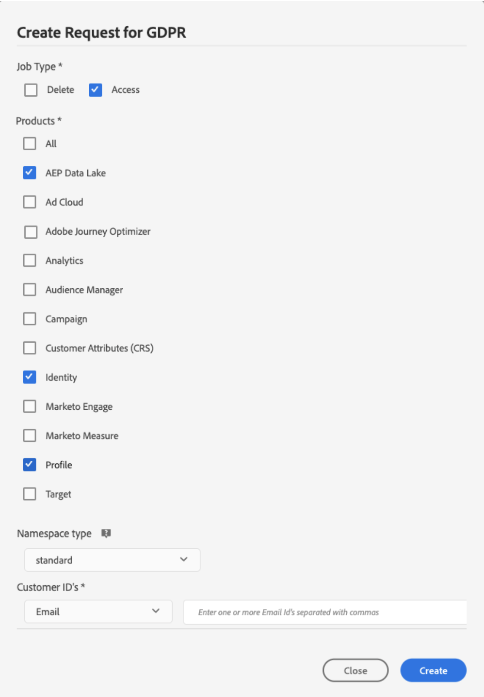
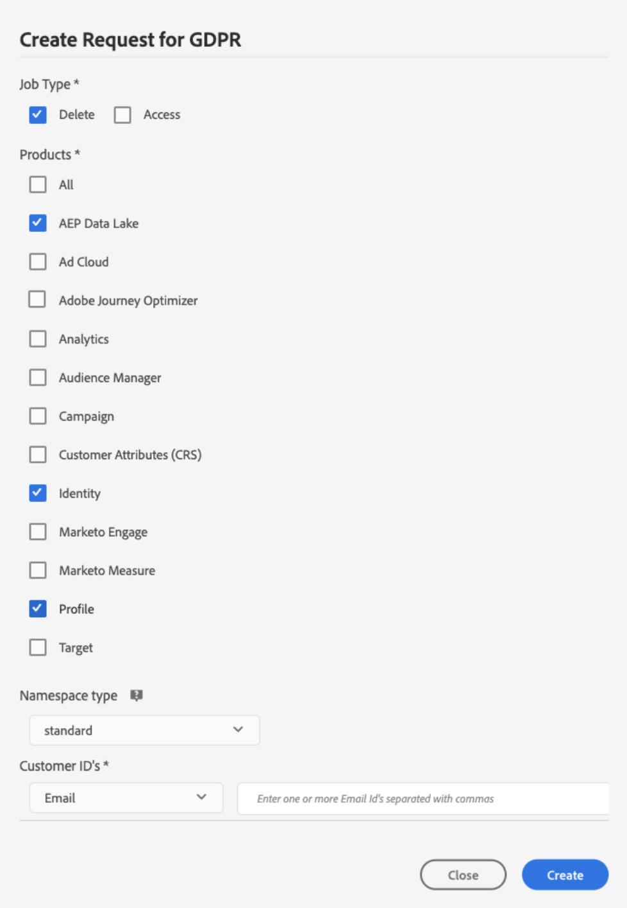

# 개인 정보 보호 요청 {#privacy-requests}

컴포지션을 만들면 결과 대상자가 Adobe Experience Platform에 저장됩니다.

그런 다음 고객 데이터 요청을 관리하는 데 도움이 되는 [사용자 인터페이스](https://experienceleague.adobe.com/docs/experience-platform/privacy/ui/user-guide.html?lang=ko){target="_blank"} 및 [RESTful API](https://experienceleague.adobe.com/ko/docs/experience-platform/privacy/api/overview){target="_blank"}를 제공하는 Adobe Experience Platform **Privacy Service**&#x200B;을(를) 통해 이러한 대상에 해당하는 프로필 데이터에 대한 개인 정보 보호 요청을 수행할 수 있습니다.

<!--With Privacy Service, you can submit requests to access and delete personal customer data from Adobe Experience Cloud applications, facilitating automated compliance with legal and organizational privacy regulations.

Privacy requests can be created and managed from the **[!UICONTROL Requests]** menu.

-->

>[!NOTE]
>
>Privacy Service에 대한 자세한 내용은 [Adobe Experience Platform 설명서](https://experienceleague.adobe.com/docs/experience-platform/privacy/home.html?lang=ko-KR){target="_blank"}를 참조하세요.

Adobe Federated Audience Composition에서 고객 데이터에 액세스하고 삭제하는 개별 요청을 만들고 관리할 수 있습니다. **액세스 요청** 및 **삭제 요청**&#x200B;을 제출하는 단계는 [실시간 고객 프로필 설명서](https://experienceleague.adobe.com/ko/docs/experience-platform/profile/privacy){target="_blank"}에 자세히 설명되어 있습니다.

<!--## Manage individual data privacy requests {#data-privacy-requests}

You can submit individual requests to access and delete consumer data from Adobe Federated Audience Composition in two ways:

* Through the **Privacy Service UI**. [Learn more](https://experienceleague.adobe.com/docs/experience-platform/privacy/ui/user-guide.html?lang=ko){target="_blank"}
* Through the **Privacy Service API**. [Learn more](https://experienceleague.adobe.com/ko/docs/experience-platform/privacy/api/overview){target="_blank"}

///More specific information on Privacy Service API [here](https://developer.adobe.com/experience-platform-apis/references/privacy-service/#_blank).

Privacy Service supports two types of requests: **data access** and **data deletion**.

For **access requests** and **delete requests**, specify the three following services from the UI:

* Profile (product code: "profileService" in the API)
* AEP Data Lake (product code: "aepDataLake" in the API)
* Identity (product code: "identity" in the API)

## Create Access and Delete requests

### Prerequisites

To make requests to Access and Delete data for Adobe Federated Audience Composition, you must have:

* an Adobe organization ID
* an Identity identifier of the person you want to act on and the corresponding namespace(s). For more information about identity namespaces Experience Platform, see the [identity namespace overview](https://experienceleague.adobe.com/ko/docs/experience-platform/identity/features/namespaces).

### Required field values for API requests

```json
"companyContexts":
    "namespace": imsOrgID
    "value": <Your Adobe Organization ID Value>

"users":
    "action": either access or delete

    "userIDs":
        "namespace": e.g. email, aaid, ecid, etc.
        "type": standard
        "value": <Data Subject's Identity Identifier>

"include":
    profileService (product code for Profile)
    aepDataLake (product code for AEP Data Lake)
    identity (product code for Identity)

"regulation":
    gdpr, ccpa, pdpa, lgpd_bra, or nzpa_nzl (which is the privacy regulation that applies to the request)
```


### GDPR Access request example

From the UI:

{width="60%" align="center"}

Through the API:

```json
// JSON Request
{
   "companyContexts":[
      {
         "namespace":"imsOrgID",
         "value":"745F37C35E4B776E0A49421B@AdobeOrg"
      }
   ],
   "users":[
      {
         "action":[
            "access"
         ],
         "userIDs":[
            {
               "namespace":"ecid",
               "value":"38400000-8cf0-11bd-b23e-10b96e40000d",
               "type":"standard"
            },
            {
               "namespace":"email",
               "value":"johndoe4@gmail.com",
               "type":"standard"
            }
         ]
      }
   ],
   "include":[
    "profileService", "aepDataLake", "identity"
   ],
   "regulation":"gdpr"
}
```

```json
// JSON Response
{
    "requestId": "17163122360480365RX-705",
    "totalRecords": 1,
    "jobs": [
        {
            "jobId": "e709b1f4-1796-11ef-b422-eddd0aebc40d",
            "customer": {
                "user": {
                    "key": "John Doe",
                    "action": [
                        "access"
                    ],
                    "userIDs": [
                        {
                            "namespace": "ecid",
                            "value": "38400000-8cf0-11bd-b23e-10b96e40000d",
                            "type": "standard",
                            "namespaceId": 4,
                            "isDeletedClientSide": false
                        },
                        {
                            "namespace": "email",
                            "value": "johndoe4@gmail.com",
                            "type": "standard",
                            "namespaceId": 6,
                            "isDeletedClientSide": false
                        }
                    ]
                }
            }
        }
    ]
}
```

### GDPR Delete request example

From the UI:

{width="60%" align="center"}

Through the API:

```json
// JSON Request
{
  "companyContexts": [
    {
      "namespace": "imsOrgID",
      "value": "745F37C35E4B776E0A49421B@AdobeOrg"
    }
  ],
  "users": [
    {
      "action": [
          "delete"
      ],
      "userIDs": [
        {
          "namespace": "ecid",
          "value": "38400000-8cf0-11bd-b23e-10b96e40000d",
          "type": "standard"
        },
                {
          "namespace": "email",
          "value": "johndoe4@gmail.com",
          "type": "standard"
        }
      ]
    }
  ],
  "include": [
    "profileService", "aepDataLake", "identity"
  ],
  "regulation": "gdpr"
}
```

```json
// JSON Response
{
    "requestId": "17163122360480365RX-705",
    "totalRecords": 1,
    "jobs": [
        {
            "jobId": "e709b1f4-1796-11ef-b422-eddd0aebc40d",
            "customer": {
                "user": {
                    "key": "John Doe",
                    "action": [
                        "delete"
                    ],
                    "userIDs": [
                        {
                            "namespace": "ecid",
                            "value": "38400000-8cf0-11bd-b23e-10b96e40000d",
                            "type": "standard",
                            "namespaceId": 4,
                            "isDeletedClientSide": false
                        },
                        {
                            "namespace": "email",
                            "value": "johndoe4@gmail.com",
                            "type": "standard",
                            "namespaceId": 6,
                            "isDeletedClientSide": false
                        }
                    ]
                }
            }
        }
    ]
}
```
-->