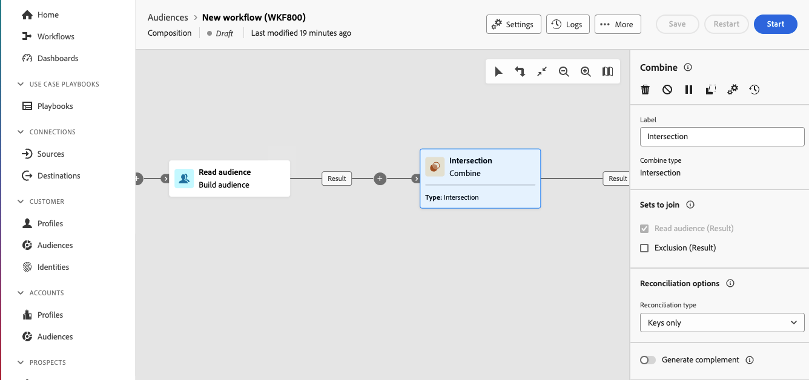

# 결합 {#combine}

>[!CONTEXTUALHELP]
>id="dc_orchestration_combine"
>title="활동 결합"
>abstract="**결합** 활동을 통해 인바운드 모집단에 대한 세분화를 수행할 수 있습니다. 따라서 여러 모집단을 결합하거나, 일부를 제외하거나, 데이터를 여러 대상에 공통으로 유지할 수 있습니다."

**결합** 활동을 통해 인바운드 모집단에 대한 세분화를 수행할 수 있습니다. 따라서 여러 모집단을 결합하고 일부를 제외하거나 데이터를 여러 대상에 공통된 상태로 유지할 수 있습니다.

**Combine** 활동은 다른 활동 뒤에 배치할 수 있지만 컴포지션 시작 부분에는 배치할 수 없습니다. 모든 활동은 **결합** 뒤에 배치할 수 있습니다.

## 결합 활동 구성 {#combine-configuration}

>[!CONTEXTUALHELP]
>id="dc_orchestration_intersection_merging_options"
>title="교차 병합 옵션"
>abstract="**교집합** 기능을 사용하면 활동에서 다른 인바운드 집단에 공통되는 요소만 유지할 수 있습니다. **참여 설정** 섹션에서 참여하려는 모든 이전 활동을 선택하십시오."

>[!CONTEXTUALHELP]
>id="dc_orchestration_exclusion_merging_options"
>title="제외 병합 옵션"
>abstract="**제외** 기능을 사용하면 특정 기준에 따라 한 집단에서 요소를 제외할 수 있습니다. **참여 설정** 섹션에서 참여하려는 모든 이전 활동을 선택하십시오."

>[!CONTEXTUALHELP]
>id="dc_orchestration_combine_options"
>title="세분화 유형 선택"
>abstract="통합, 교차 또는 제외 등 대상자를 결합하는 방법을 선택합니다."

**결합** 활동 구성을 시작하려면 다음과 같은 일반적인 단계를 따르십시오.

1. 여러 활동을 추가하여 두 개 이상의 실행 분기를 만듭니다.

1. 이전 분기에 **결합** 활동을 추가합니다.

1. 세분화 유형: [통합](#union), [교차](#intersection) 또는 [제외](#exclusion)를 선택하고 **계속**&#x200B;을 클릭합니다.

   

1. **가입하도록 설정** 섹션에서 가입하려는 이전 활동을 모두 확인하십시오.

## 합집합 {#combine-union}

>[!CONTEXTUALHELP]
>id="dc_orchestration_intersection_reconciliation_options"
>title="교집합 조정 옵션"
>abstract="중복 처리 방법을 정의하려면 조정 유형을 선택합니다."

>[!CONTEXTUALHELP]
>id="dc_orchestration_combine_reconciliation"
>title="조정 옵션"
>abstract="중복 처리 방법을 정의하려면 **조정 유형**&#x200B;을 선택합니다."

**결합** 활동에서 **결합**&#x200B;을 구성할 수 있습니다.

이를 위해 **조정 유형**&#x200B;을(를) 선택하여 중복 처리 방법을 정의해야 합니다.

* **키 전용**: 기본 모드입니다. 다른 인바운드 전환의 요소가 동일한 키를 가지면 활동은 하나의 요소만 유지합니다. 이 옵션은 인바운드 모집단이 동질적일 경우에만 사용할 수 있습니다.
* **열 선택**: 데이터 조정을 적용할 열 목록을 정의하려면 이 옵션을 선택하십시오. 기본 세트(소스 데이터가 있는 세트)를 먼저 선택한 다음 결합에 사용할 열을 선택해야 합니다.

## 교집합 {#combine-intersection}

**결합** 활동에서 **교차**&#x200B;를 구성할 수 있습니다.

이를 위해 아래의 추가 단계를 수행합니다.

1. 중복 처리 방법을 정의하려면 **조정 유형**&#x200B;을 선택합니다. [합집합](#union) 섹션을 참조하십시오.
1. 나머지 모집단을 처리하려면 **보조 항목 생성** 옵션을 선택할 수 있습니다. 여집합에는 교차를 제외한 모든 인바운드 활동 결과의 합집합이 포함됩니다. 그런 다음 추가 아웃바운드 전환이 활동에 추가됩니다.

## 제외 {#combine-exclusion}

>[!CONTEXTUALHELP]
>id="dc_orchestration_exclusion_options"
>title="제외 규칙"
>abstract="필요한 경우 인바운드 테이블을 조작할 수 있습니다. 다른 스키마(즉, 타기팅 차원)에서 대상을 제외하려면 이 대상을 기본 대상과 동일한 스키마로 반환해야 합니다. 이 작업을 수행하려면 **제외 규칙** 섹션에서 **규칙 추가**&#x200B;를 클릭하고 스키마 변경 조건을 지정합니다. 데이터 조정은 속성 또는 참여를 통해 수행됩니다."

>[!CONTEXTUALHELP]
>id="dc_orchestration_combine_sets"
>title="결합할 세트 선택"
>abstract="**참여 설정** 섹션에서 인바운드 전환의 **기본 세트**&#x200B;를 선택합니다. 요소가 제외되는 집합입니다. 다른 집합은 기본 집합에서 제외되기 전에 요소와 일치합니다."

>[!CONTEXTUALHELP]
>id="dc_orchestration_combine_exclusion"
>title="제외 규칙"
>abstract="필요한 경우 인바운드 테이블을 조작할 수 있습니다. 다른 스키마(즉, 타기팅 차원)에서 대상을 제외하려면 이 대상을 기본 대상과 동일한 스키마로 반환해야 합니다. 이 작업을 수행하려면 **제외 규칙** 섹션에서 **규칙 추가**&#x200B;를 클릭하고 스키마 변경 조건을 지정합니다. 데이터 조정은 속성 또는 참여를 통해 수행됩니다."

>[!CONTEXTUALHELP]
>id="dc_orchestration_combine_complement"
>title="결합 생성 여집합"
>abstract="추가 전환에서 나머지 집단을 처리하려면 **여집합 생성** 옵션을 토글합니다."

**결합** 활동에서 **제외**&#x200B;를 구성할 수 있습니다.

이를 위해 아래의 추가 단계를 수행해야 합니다.

1. **참여 설정** 섹션에서 인바운드 전환의 **기본 세트**&#x200B;를 선택합니다. 요소가 제외되는 집합입니다. 다른 집합은 기본 집합에서 제외되기 전에 요소와 일치합니다.

1. 필요한 경우 인바운드 테이블을 조작할 수 있습니다. 실제로 다른 스키마에서 대상을 제외하려면 이 대상을 기본 대상과 동일한 스키마로 반환해야 합니다. 이 작업을 수행하려면 **제외 규칙** 섹션에서 **규칙 추가**&#x200B;를 클릭하고 스키마 변경 조건을 지정합니다. 데이터 조정은 속성 또는 조인을 통해 수행됩니다. <!-- pas compris-->
1. 나머지 모집단을 처리하려면 **완료 생성** 옵션을 선택할 수 있습니다. [교차](#intersection) 섹션을 참조하십시오.

<!--
## Examples{#combine-examples}

In the following example, we are using a **Combine** activity and we add a **union** to retrieves all the profiles of the two queries: persons between 18 and 27 years old and persons between 34 and 40 years old.

The following example shows the **intersection** between two query activities. It is being used here to retrieve profiles who are between 18 to 27 years old and whose email address has been provided.

The following **exclusion** example shows two queries configured to filter profiles who are between 18 and 27 years old and have an Adobe email domain. The profiles with an Adobe email domain are then excluded from the first set. 

-->
