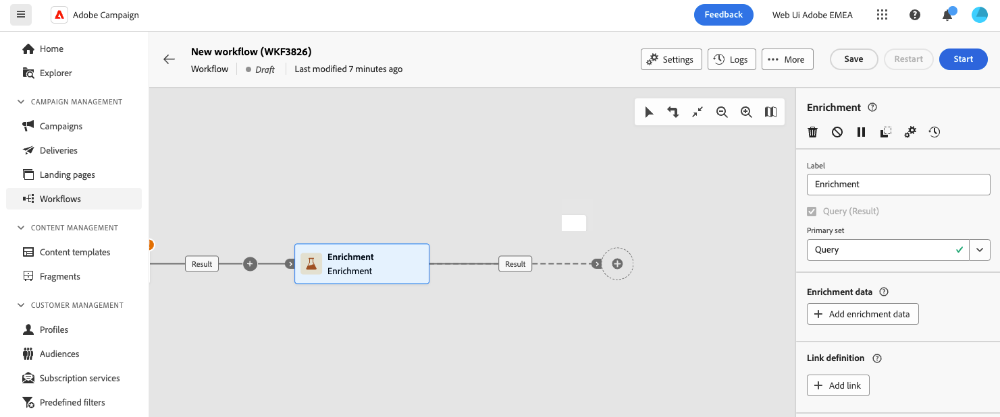

# 보강 {#enrichment}

>[!CONTEXTUALHELP]
>id="dc_orchestration_enrichment"
>title="보강 활동"
>abstract="**보강** 활동을 사용하면 데이터베이스의 추가 정보로 타겟팅된 데이터를 보강할 수 있습니다. 일반적으로 활동을 세분화한 후 구성에서 사용됩니다."

>[!CONTEXTUALHELP]
>id="dc_orchestration_enrichment_data"
>title="보강 활동"
>abstract="보강 데이터가 구성에 추가되면 **보강** 활동 이후에 추가된 활동에서 이를 사용하여 비헤이비어, 환경 설정 및 선택 사항을 기준으로 프로필을 별개의 그룹으로 분류할 수 있습니다."

>[!CONTEXTUALHELP]
>id="dc_orchestration_enrichment_simplejoin"
>title="링크 정의"
>abstract="작업 테이블 데이터와 페더레이션된 데이터베이스 간의 링크를 만듭니다."

>[!CONTEXTUALHELP]
>id="dc_orchestration_enrichment_reconciliation"
>title="보강 조정"
>abstract="조정 매개변수를 설정합니다."

>[!CONTEXTUALHELP]
>id="dc_targetdata_personalization_enrichmentdata"
>title="보강 데이터"
>abstract="구성을 강화하는 데 사용할 데이터를 선택합니다. 보강 데이터의 두 가지 유형, 스키마(즉, 타겟팅 차원)의 단일 보강 속성 또는 테이블 간에 1-N 카디널리티가 있는 링크인 컬렉션 링크를 선택할 수 있습니다."

**데이터 보강** 활동을 사용하면 대상 데이터를 통합 데이터베이스의 추가 정보로 향상시킬 수 있습니다. 이는 일반적으로 세그먼테이션 활동 후 컴포지션에서 사용됩니다.

보강 데이터의 출처는 다음 중 하나일 수 있습니다.

* **동일한 작업 테이블에서**&#x200B;을(를) 작성에 타깃팅했습니다.

  *고객 그룹을 타겟팅하고 현재 작업 표에 &quot;생년월일&quot; 필드를 추가*.

* **다른 작업 테이블**:

  *고객 그룹 타겟팅 후 “구매” 테이블의 “수량” 및 “제품 유형” 필드 추가*

데이터 보강 데이터가 컴포지션에 추가되면 **데이터 보강** 활동 후 추가된 활동에 데이터 보강 데이터를 사용하여 고객의 동작, 환경 설정 및 선택 사항에 따라 고객을 개별 그룹으로 분류할 수 있습니다.

<!--For instance, you can add to the working table information related to customers' purchases and use this data to personalize emails with their latest purchase or the amount spent on these purchases.-->

## 데이터 보강 활동 구성 {#enrichment-configuration}

**보강** 활동을 구성하려면 다음 단계를 따르십시오.

1. **대상자 빌드** 및 **결합** 활동과 같은 활동을 추가합니다.
1. **보강** 활동을 추가합니다.

   

1. 컴포지션에 여러 개의 전환이 구성된 경우 **[!UICONTROL 기본 집합]** 필드를 사용하여 데이터를 보강하기 위해 기본 집합으로 사용해야 하는 전환을 정의할 수 있습니다.

1. **데이터 보강 추가**&#x200B;를 클릭하고 데이터를 보강하는 데 사용할 특성을 선택하십시오.

   

   >[!NOTE]
   >
   >특성 선택 화면의 **표현식 편집 단추**&#x200B;를 사용하면 특성을 선택할 고급 표현식을 작성할 수 있습니다.

<!--PAS VU SUR INSTANCE: You can select two types of enrichment data: a single enrichment attribute from the target dimension, or a collection link. Each of these types is detailed in the examples below:

    * [Single enrichment attribute](#single-attribute)
    * [Collection lnk](#collection-link)-->

## 예시 {#example}

### 단일 보강 속성 {#single-attribute}

여기에서 생년월일과 같은 단일 보강 속성만 추가합니다. 다음 단계를 수행하십시오.

1. **속성** 필드 내부를 클릭합니다.
1. 스키마에서 타겟팅 차원이라고도 하는 간단한 필드(이 예제에서는 생년월일)를 선택합니다.
1. **확인**&#x200B;을 클릭합니다.

<!--### Collection link {#collection-link}

In this more complex use case, we will select a collection link which is a link with a 1-N cardinality between tables. Let's retrieve the three latest purchases that are less than 100$. For this you need to define:

* an enrichment attribute: the **Total amount** field
* the number of lines to retrieve: 3
* a filter: filter out items that are greater than 100$
* a sorting: descendant sorting on the **Order date** field. 

#### Add the attribute {#add-attribute}

This is where you select the collection link to use as enrichment data.

1. Click inside the **Attribute** field.
1. Click **Display advanced attributes**.
1. Select the **Total amount** field from the **Purchases** table. 

#### Define the collection settings{#collection-settings}

Then, define how the data is collected and the number of records to retrieve.

1. Select **Collect data** in the **Select how the data is collected** drop-down.
1. Type "3" in the **Lines to retrieve (Columns to create)** field. 

If you want, for example, to get the average amount of purchases for a customer, select **Aggregated data** instead, and select **Average** in the **Aggregate function** drop-down.

#### Define the filters{#collection-filters}

Here, we define the maximum value for the enrichment attribute. We filter out items that are greater than 100$. [Learn how to work with the query modeler](../../query/query-modeler-overview.md)

1. Click **Edit filters**.
1. Add the two following filters: **Total amount** exists AND **Total amount** is less than 100. The first one filters NULL values as they would appear as the greatest value.
1. Click **Confirm**.

#### Define the sorting{#collection-sorting}

We now need to apply sorting in order to retrieve the three **latest** purchases.

1. Activate the **Enable sorting** option.
1. Click inside the **Attribute** field.
1. Select the **Order date** field.
1. Click **Confirm**. 
1. Select **Descending** from the **Sort** drop-down.-->
