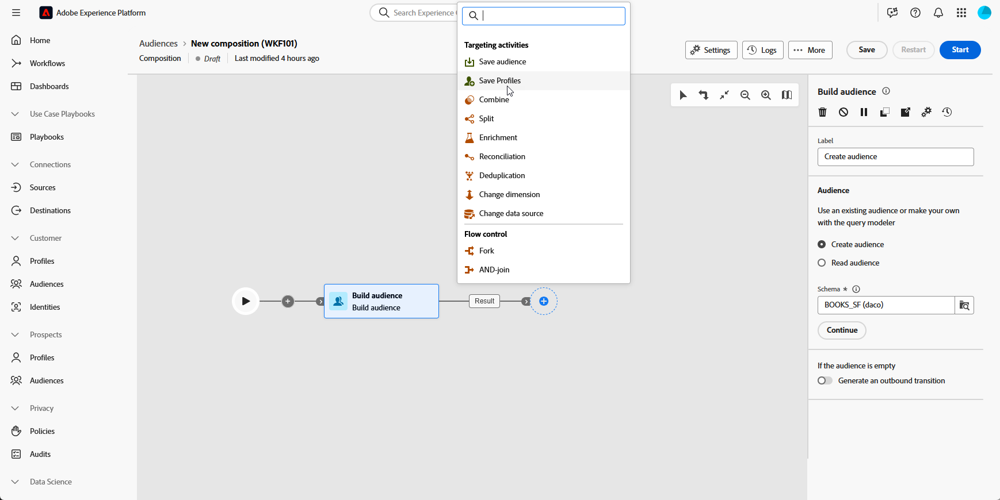

# 프로필 저장 {#save-profile}

>[!CONTEXTUALHELP]
>id="dc_orchestration_saveprofile"
>title="프로필 저장"
>abstract="프로필 저장 활동을 통해 외부 웨어하우스의 데이터를 통합하여 Adobe Experience Platform 프로필을 강화하고, 추가 속성을 통해 고객 프로필을 개선할 수 있습니다. "

>[!CONTEXTUALHELP]
>id="dc_orchestration_saveprofile_aepschemalist"
>title="Experience Platform 스키마 선택"
>abstract="프로필에 대해 Experience Platform 스키마를 선택합니다."

>[!CONTEXTUALHELP]
>id="dc_orchestration_saveprofile_primaryidentitynamespace"
>title="기본 식별 필드 선택"
>abstract="데이터베이스에서 타기팅된 프로필을 식별하는 데 사용할 기본 ID를 선택합니다."

>[!CONTEXTUALHELP]
>id="dc_orchestration_saveprofile_selectaepschema"
>title="Experience Platform 스키마 선택"
>abstract="프로필에 대해 Experience Platform 스키마를 선택합니다."

>[!CONTEXTUALHELP]
>id="dc_orchestration_saveprofile_updatemode"
>title="프로필 업데이트 모드 저장"
>abstract="프로필 저장 활동에 사용 가능한 업데이트 모드에는 전체 업데이트 및 증분 업데이트가 포함됩니다."

>[!CONTEXTUALHELP]
>id="dc_orchestration_saveprofile_updatemode_full"
>title="전체 업데이트"
>abstract="전체 업데이트 모드는 보강할 전체 프로필 세트를 업데이트합니다."

>[!CONTEXTUALHELP]
>id="dc_orchestration_saveprofile_updatemode_incremental"
>title="증분 업데이트"
>abstract="증분 업데이트 모드는 마지막 데이터 보강 실행 이후 수정된 프로필을 업데이트합니다."

>[!CONTEXTUALHELP]
>id="dc_orchestration_saveprofile_primaryidentityfield"
>title="기본 ID 필드"
>abstract="기본 ID 필드는 강화를 위해 프로필을 함께 병합할 때 신뢰할 수 있는 소스를 나타냅니다."

>[!CONTEXTUALHELP]
>id="dc_orchestration_saveprofile_requiredfieldscheck"
>title="필수 필드 기준"
>abstract="필수 필드는 데이터를 내보낼 때 모든 프로필 또는 레코드에 대해 채워야 하는 속성입니다. 필수 필드가 누락된 경우 내보내기가 완료되지 않거나 유효하지 않습니다."

>[!CONTEXTUALHELP]
>id="dc_orchestration_saveprofile_primaryidentitycheck"
>title="기본 ID 필드 기준"
>abstract="각 프로필 또는 레코드에 대한 고유 식별자. 이렇게 하면 모든 레코드를 명확히 인식하고 일치시킬 수 있으므로 데이터 중복을 방지할 수 있습니다."

**프로필 저장** 활동을 사용하면 외부 웨어하우스에서 페더레이션된 데이터로 Adobe Experience Platform 프로필을 보강할 수 있습니다.

이 활동은 일반적으로 데이터를 플랫폼으로 물리적으로 이동하거나 복제하지 않고 추가 속성 및 통찰력을 가져와 고객 프로필을 개선하는 데 사용됩니다.

## 프로필 저장 활동 구성 {#save-profile-configuration}

**프로필 저장** 활동을 구성하려면 다음 단계를 따르십시오.

1. 컴포지션에 **프로필 저장** 활동을 추가합니다.

   

1. 만들 프로필의 레이블을 지정합니다.

   >[!IMPORTANT]
   >
   >대상 레이블은 현재 샌드박스 내에서 고유해야 합니다. 기존 대상자와 동일한 레이블이 될 수 없습니다.

1. 사용할 Adobe Experience Platform 스키마를 선택합니다.

   

1. 데이터베이스에서 프로필을 식별하는 데 사용할 기본 ID 필드를 선택합니다.

1. 추가 데이터 특성을 조정하려면 **특성 추가**&#x200B;를 클릭하세요.

   그런 다음 매핑할 각 특성에 대해 **Source** 필드(외부 데이터)와 **대상** 필드(스키마 필드)를 지정합니다.

   

1. 구성이 완료되면 **시작**&#x200B;을 클릭하세요.
