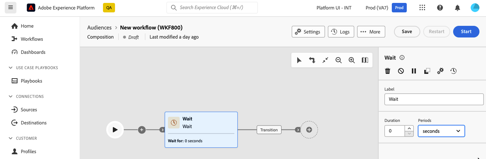

# 대기 {#wait}

>[!CONTEXTUALHELP]
>id="dc_orchestration_wait"
>title="대기 활동"
>abstract="**대기** 활동을 사용하여 전환을 활동에서 다른 활동으로 지연합니다."

**대기** 활동을 사용하면 실행 중인 두 활동 사이에 일정 시간이 지나도록 할 수 있습니다.

## 구성{#wait-configuration}

**대기** 활동을 구성하려면 다음 단계를 따르십시오.

1. 컴포지션에 **대기** 활동을 추가합니다.

1. 인바운드 전환과 아웃바운드 전환 사이의 대기 **기간**&#x200B;을 지정합니다.

1. **기간** 필드에서 시간 단위(초, 분, 시간, 일)를 선택합니다.

   
