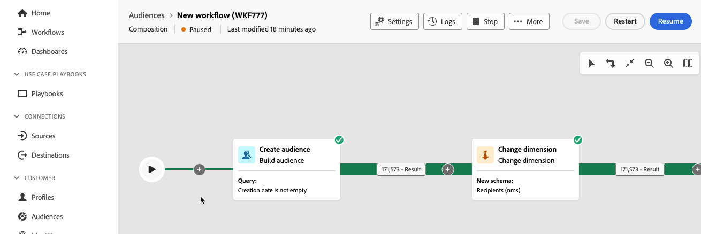

# 컴포지션 만들기

페더레이션된 대상자 컴포지션을 사용하면 다양한 활동을 시각적 캔버스로 활용하여 대상자를 생성할 수 있는 컴포지션을 만들 수 있습니다. 컴포지션을 만든 후 결과 대상자는 Adobe Experience Platform에 저장되며, 이를 Experience Platform 대상 및 Adobe Journey Optimizer에서 활용하여 고객을 타기팅할 수 있습니다.

## 컴포지션 정의 {#create}

>[!CONTEXTUALHELP]
>id="dc_composition_creation_properties"
>title="컴포지션 속성"
>abstract="이 화면에서 컴포지션을 만들고 레이블을 지정하는 데 사용할 템플릿을 선택합니다. 추가 옵션 섹션을 확장하여 컴포지션 내부 이름, 해당 폴더, 시간대, 감독자 그룹 등의 추가적인 설정을 구성합니다. 오류 발생 시 운영자에게 알림을 전송할 수 있도록 감독자 그룹을 선택하는 것을 강력히 권장합니다."

컴포지션을 만들려면 먼저 해당 레이블을 정의하고 선택적으로 추가 설정을 구성해야 합니다.

컴포지션을 만들려면 **[!UICONTROL 고객]** 섹션 내에서 **[!UICONTROL 대상]**&#x200B;을 선택한 다음 **[!UICONTROL 통합 컴포지션]** 탭을 선택합니다.

통합 구성 찾아보기 페이지가 나타납니다. 컴포지션 만들기 프로세스를 계속하려면 **[!UICONTROL 컴포지션 만들기]**&#x200B;를 선택하십시오.

**[!UICONTROL 속성]** 섹션에서 컴포지션에 대한 레이블을 지정하고 데이터 모델을 선택합니다. 이 데이터 모델과 연결된 스키마만 컴포지션의 활동에서 사용할 수 있습니다.

Select **[!UICONTROL Create]**. 컴포지션 캔버스가 표시됩니다. 이제 캔버스에 활동 및 전환을 추가하여 컴포지션을 구성할 수 있습니다.

## 컴포지션 캔버스 {#canvas}

캔버스 맨 위에서 활동을 관리하고 탐색할 수 있는 옵션을 제공하는 도구 모음에 액세스할 수 있습니다.

사용 가능한 옵션은 다음과 같습니다.

* **[!UICONTROL 여러 선택]**: 여러 활동을 선택하여 한 번에 모두 삭제하거나 복사하여 붙여 넣으십시오.
* **[!UICONTROL 회전]**: 캔버스를 세로로 전환합니다.
* **[!UICONTROL 화면에 맞춤]**: 캔버스 확대/축소 수준을 화면에 맞춥니다.
* **[!UICONTROL 확대]** / **[!UICONTROL 축소]**: 캔버스를 확대하거나 축소합니다.
* **[!UICONTROL 맵 표시]**: 현재 위치를 보여 주는 캔버스의 스냅숏을 엽니다.

## 활동 추가 {#add-activities}

컴포지션 캔버스에서 대상을 정의하는 데 도움이 되는 활동 및 전환을 추가할 수 있습니다. 활동을 통해 대상 내에서 구성 요소를 *정의*&#x200B;할 수 있고 전환을 통해 구성 흐름을 *구성*&#x200B;할 수 있습니다.

사용할 수 있는 활동 및 전환에 대한 자세한 내용은 [활동 개요](./activities.md)를 참조하세요.

## 활동 관리 {#manage-activities}

속성 창에서 추가된 활동에 대해 작업을 수행할 수 있습니다.

옵션은 다음과 같습니다.

* **[!UICONTROL 삭제]**: 캔버스에서 활동을 삭제합니다.
* **[!UICONTROL 사용 안 함]/[!UICONTROL 사용]**: 활동을 사용하지 않도록 설정하거나 사용하도록 설정합니다. 컴포지션이 실행되면 비활성화된 활동과 동일한 경로에서 다음 활동이 실행되지 않고 컴포지션이 중지됩니다.
* **[!UICONTROL 일시 중지]/[!UICONTROL 다시 시작]**: 활동을 일시 중지하거나 다시 시작합니다. 컴포지션이 실행되면 일시 중지된 활동에서 일시 중지됩니다. 여기에 해당하는 작업과 동일한 경로에서 해당 작업에 따라오는 모든 작업은 실행되지 않습니다.
* **[!UICONTROL 복사]**: 활동을 복사하여 컴포지션의 다른 위치에 붙여넣습니다. 이렇게 하려면 전환에서 **+** 단추를 선택하고 **[!UICONTROL X 활동 붙여넣기]**&#x200B;를 선택합니다. <!-- cannot copy multiple activities ? cannot paste in another composition?-->
* 선택한 활동에 대해 **[!UICONTROL 실행 옵션]**&#x200B;을 구성하십시오. 사용 가능한 실행 옵션은 다음과 같습니다.
  +++사용 가능한 실행 옵션

  **[!UICONTROL 속성]** 섹션에서 활동 실행과 관련된 일반 설정을 구성할 수 있습니다.

   * **[!UICONTROL 실행]**: 작업이 시작될 때 수행할 작업을 정의합니다.
   * **[!UICONTROL 최대 실행 기간]**: &quot;30s&quot; 또는 &quot;1h&quot;와 같은 기간을 지정하십시오. 지정된 기간이 경과한 후 활동이 완료되지 않으면 경고가 트리거됩니다. 이는 컴포지션의 작동 방식에는 영향을 주지 않습니다.
   * **[!UICONTROL 시간대]**: 활동의 시간대를 선택합니다. Federated Audience Composition을 사용하면 동일한 인스턴스에서 여러 국가 간의 시간 차이를 관리할 수 있습니다. 적용된 설정은 인스턴스가 생성될 때 구성됩니다.
   * **[!UICONTROL 선호도]**: 컴퍼지션 활동을 특정 컴퓨터에서 강제로 실행합니다. 이렇게 하려면 해당 활동에 대한 관심도를 하나 또는 여러 개 지정해야 합니다.
   * **[!UICONTROL 동작]**: 비동기 작업이 사용되는 경우 따라야 할 프로시저를 정의합니다.

  **[!UICONTROL 오류 관리]** 섹션에서 활동에 오류가 발생할 경우 수행할 작업을 지정할 수 있습니다.

  **[!UICONTROL 초기화 스크립트]** 섹션에서 변수를 초기화하거나 활동 속성을 수정할 수 있습니다. **[!UICONTROL 코드 편집]** 단추를 선택하고 실행할 코드 조각을 입력하십시오. 활동이 실행될 때 스크립트가 호출됩니다.

  +++
* **로그 및 작업**: 선택한 활동에 대한 로그 및 작업을 봅니다.

## 컴포지션 시작 및 모니터링 {#start-and-monitor}

컴포지션에 활동을 추가한 후 컴포지션의 실행을 시작할 수 있습니다. 컴포지션을 시작하려면 화면 오른쪽 상단에서 **[!UICONTROL 시작]** 단추를 선택합니다.

| 작업 | 설명 |
| ------ | ----------- |
| **시작** | 컴포지션 실행을 시작하고 **진행 중** 상태로 이동합니다. |
| **일시 중지** | 컴포지션 실행을 일시 중지하고 **일시 중지됨** 상태로 설정합니다. 작성을 다시 시작해야 새 활동이 활성화되지만 진행 중인 작업은 일시 중단되지 **않습니다**. |
| **다시 시작** | 일시 중지된 컴포지션 실행을 다시 시작하고 **진행 중** 상태로 설정합니다. |
| **중지** | 컴포지션의 실행을 중지하고 **완료** 상태로 설정합니다. **중단된 위치와 동일한 위치에서 작성을 다시 시작할 수 없습니다**. |
| **다시 시작** | 컴포지션 실행을 중지했다가 다시 시작합니다. |

컴포지션이 실행 중일 때 캔버스의 각 활동은 컴포지션의 끝에 도달할 때까지 순차적 순서로 실행됩니다. 시각적인 흐름을 사용하여 실시간으로 타겟팅된 프로필의 진행 상황을 추적할 수 있습니다. 이렇게 하면 각 활동의 상태와 활동 간에 전환되는 프로필 수를 빠르게 식별할 수 있습니다.

각 활동의 오른쪽 상단 모서리에 있는 시각적 표시기에는 실행 상태가 표시됩니다.

| 시각적 표시기 | 설명 |
| ---------------- | ------------|
| {zoomable="yes"}{width="70%"} | 활동이 현재 실행 중입니다. |
| {zoomable="yes"}{width="70%"} | 이 활동에는 주의가 필요합니다. 이 주의에는 게재 전송을 확인하거나 필요한 조치를 취하는 작업이 포함될 수 있습니다. |
| {zoomable="yes"}{width="70%"} | 활동에서 오류가 발생했습니다. 문제를 해결하려면 구성 로그에서 자세한 정보를 엽니다. |
| {zoomable="yes"}{width="70%"} | 활동이 성공적으로 실행되었습니다. |

### 로그 및 작업 모니터링 {#monitor-logs}

또한 구성 로그를 보고 제대로 실행되는지 확인할 수 있습니다. 이 정보를 보려면 작업 도구 모음에서 **[!UICONTROL 로그]**&#x200B;를 선택하십시오.

**[!UICONTROL 작성 로그 및 작업]** 화면이 나타납니다. 이렇게 하면 모든 사용자 작업을 기록하고 오류가 발생한 작성 실행 기록이 제공됩니다.

내역은 아래에 자세히 설명된 여러 탭으로 구성됩니다.

* **[!UICONTROL 로그]** 탭에는 모든 작성 작업의 실행 기록이 들어 있습니다. 시간 순서대로 수행된 작업과 실행 오류를 색인화합니다.
* **[!UICONTROL 작업]** 탭은 활동의 실행 시퀀싱에 대해 자세히 설명합니다. 각 작업의 끝에 있는 버튼을 사용하면 활동을 통해 전달된 이벤트 변수를 나열할 수 있습니다.
* **[!UICONTROL 변수]** 탭에는 컴포지션에서 전달된 모든 변수가 나열됩니다. 작성 캔버스에서 로그 및 작업에 액세스할 때만 사용할 수 있습니다. 이제 활동의 속성 창에서 로그에 액세스할 때 사용할 수 있습니다.

모든 탭에서 표시된 열과 해당 순서를 선택하고 필터를 적용한 다음 검색 필드를 사용하여 원하는 정보를 빠르게 찾을 수 있습니다.

### 경고 구독 {#alerts}

통합 작성 실행이 성공 또는 실패한 경우 알림을 받으려면 알림을 구독할 수도 있습니다.

알림을 구독하려면 을 선택한 다음 을 선택하세요.

{zoomable="yes"}{width="70%"}

알림 설정 페이지가 표시됩니다. 이 페이지에서 **[!UICONTROL Experience Platform]**&#x200B;을(를) 선택하고 원하는 알림 채널을 선택하십시오. UI에서 알림을 보려면 **[!UICONTROL 인앱]**&#x200B;을 선택하세요.

{zoomable="yes"}{width="50%"}

**[!UICONTROL 인앱]**&#x200B;을 선택하면 이제 작성 실행 성공 및 실패에 대한 알림을 받게 됩니다.

{zoomable="yes"}{width="70%"}

## 컴포지션 설정을 구성합니다. {#settings}

>[!CONTEXTUALHELP]
>id="dc_composition_settings_properties"
>title="컴포지션 속성"
>abstract="이 섹션에서는 컴포지션을 생성 시에도 액세스할 수 있는 일반 컴포지션 속성을 제공합니다."

>[!CONTEXTUALHELP]
>id="dc_composition_settings_segmentation"
>title="컴포지션 세분화"
>abstract="기본적으로 컴포지션의 마지막 실행에 대한 작업 테이블만 유지됩니다. 이 옵션을 활성화하여 테스트 목적으로 작업 테이블을 유지할 수 있습니다. 개발 또는 스테이징 환경&#x200B;**에서만** 사용해야 합니다. 프로덕션 환경에서는 체크해서는 안 됩니다."

>[!CONTEXTUALHELP]
>id="dc_composition_settings_error"
>title="오류 관리 설정"
>abstract="이 섹션에서는 실행 중 오류를 관리하는 방법을 정의할 수 있습니다. 프로세스를 일시 중지하거나, 특정 수의 오류를 무시하거나, 컴포지션 실행을 중지하도록 선택할 수 있습니다."

컴포지션에 액세스할 때 고급 설정에 액세스하여 오류 발생 시 컴포지션의 동작 방식 등을 정의할 수 있습니다.

이러한 추가 옵션에 액세스하려면 컴포지션 만들기 화면의 위쪽 섹션에서 **[!UICONTROL 설정]**&#x200B;을 선택합니다.

| 설정 | 설명 |
| -------- | ----------- |
| **[!UICONTROL 레이블]** | 컴포지션에 지정된 이름을 업데이트합니다. |
| **[!UICONTROL 두 실행 사이의 중간 모집단 결과 유지]** | 이 옵션을 활성화하면 컴포지션이 실행된 후에도 작업 테이블이 유지됩니다. 기본적으로 컴포지션의 마지막 실행에 대한 작업 테이블만 유지됩니다. 이전 실행의 작업 테이블은 매일 제거됩니다. 개발 또는 스테이징 환경에서만 이 설정을 활성화해야 합니다. 프로덕션 환경에서 이 설정을 **사용 안 함**&#x200B;해야 합니다. |
| **[!UICONTROL 오류 관리]** | 컴포지션에 오류가 있는 경우 수행할 작업을 정의합니다. 다음과 같은 세 가지 옵션이 있습니다. <ul><li>**[!UICONTROL 프로세스 일시 중단]**: 컴포지션이 자동으로 일시 중지되고 상태가 **[!UICONTROL 실패]**(으)로 변경됩니다. 문제가 해결되면 **[!UICONTROL 다시 시작]** 단추를 사용하여 작성을 다시 시작하십시오.</li><li>**[!UICONTROL 무시]**: 오류를 트리거한 작업의 상태가 **[!UICONTROL 실패]**(으)로 변경되지만 컴포지션은 **[!UICONTROL 시작됨]** 상태를 유지합니다.</li><li>**[!UICONTROL 프로세스 중단]**: 컴포지션이 자동으로 중지되고 상태가 **[!UICONTROL 실패]**(으)로 변경됩니다. 문제가 해결되면 **[!UICONTROL 시작]** 단추를 사용하여 작성을 다시 시작하십시오.</li></ul> |
| **[!UICONTROL 연속 오류]** | 프로세스를 중지하기 전에 무시할 수 있는 오류 수를 지정합니다. 이 수에 도달하면 컴포지션 상태가 **[!UICONTROL 실패]**(으)로 변경됩니다. 이 필드의 값이 0이면 오류 수에 관계없이 작성을 중지하지 않습니다. |
