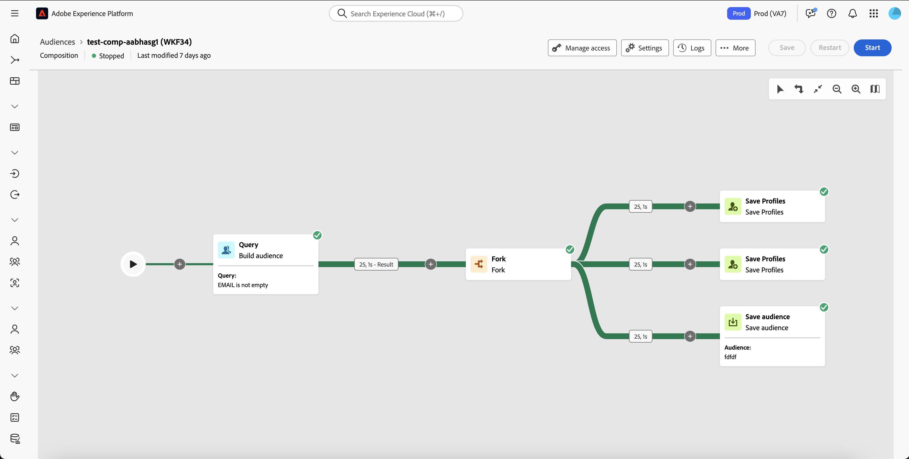

# 컴포지션을 만드는 핵심 원칙 {#gs-composition-creation}

>[!CONTEXTUALHELP]
>id="dc_composition_creation_properties"
>title="컴포지션 속성"
>abstract="이 화면에서 컴포지션을 만들고 레이블을 지정하는 데 사용할 템플릿을 선택합니다. 추가 옵션 섹션을 확장하여 컴포지션 내부 이름, 해당 폴더, 시간대, 감독자 그룹 등의 추가적인 설정을 구성합니다. 오류 발생 시 운영자에게 알림을 전송할 수 있도록 감독자 그룹을 선택하는 것을 강력히 권장합니다."

## 컴포지션 내부에 포함된 항목 {#gs-composition-inside}

Experience Platform Federated Audience Composition은 다양한 활동(분할, 강화 등)을 활용하여 대상을 만들 수 있는 시각적 캔버스를 제공합니다.

작곡 도표는 일어나기로 되어있는 것을 나타낸 것이다. 앞으로 수행할 다양한 작업과 이러한 작업이 어떻게 서로 연결되어 있는지 설명합니다.

{zoomable="yes"}{width="70%"}

각 컴포지션에는 다음이 포함됩니다.

* **[!UICONTROL 활동]**: 활동은 수행할 작업입니다. 다양한 활동이 다이어그램에 아이콘으로 표시됩니다. 각 활동에는 특정 속성과 모든 활동에 공통되는 다른 속성이 있습니다.
* **[!UICONTROL 전환]**: 전환은 원본 활동을 대상 활동에 연결하고 해당 시퀀스를 정의합니다.
* **[!UICONTROL 작업 테이블]**: 작업 테이블에는 전환에 의해 전달되는 모든 정보가 포함됩니다. 각 컴포지션은 여러 작업 테이블을 사용합니다. 이들 표에서 전달되는 데이터는 컴포지션의 수명 주기 동안 사용될 수 있다.

## 컴포지션을 만드는 주요 단계 {#gs-composition-steps}

컴포지션을 만드는 주요 단계는 다음과 같습니다.

1. [컴포지션 만들기 및 구성](../compositions/create-composition.md)
1. [활동 오케스트레이션](../compositions/orchestrate-activities.md)
1. [컴포지션 실행 및 실행 모니터링](../compositions/start-monitor-composition.md)
