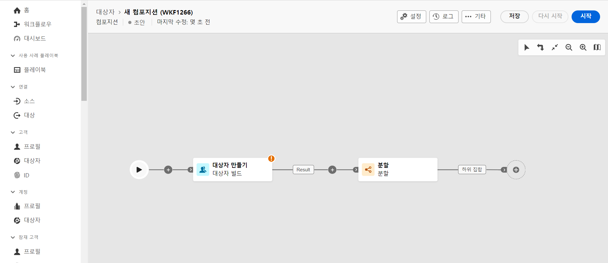
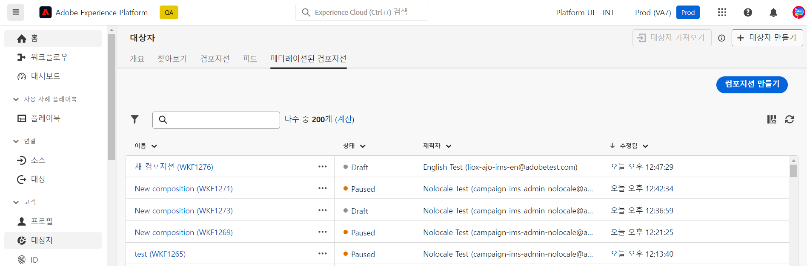
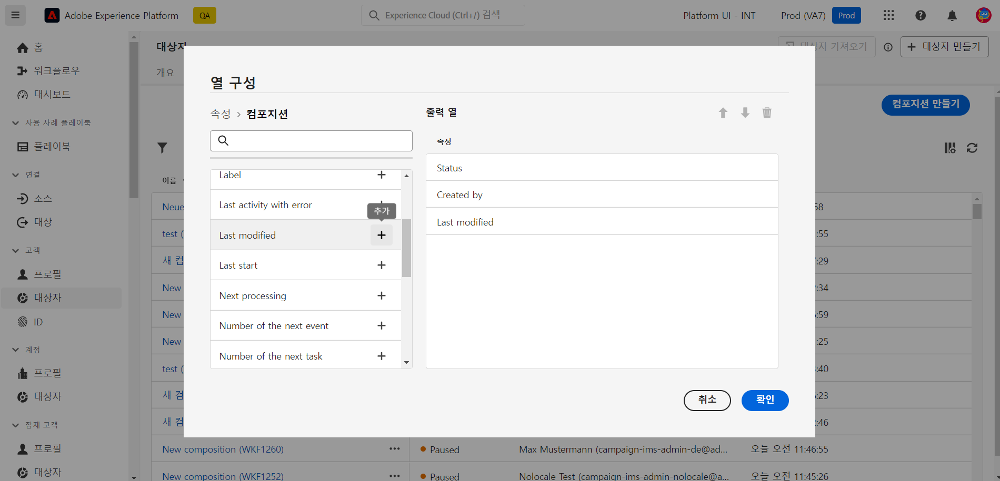

# 컴포지션 시작 {#compositions}

## 컴포지션이란? {#what}

Adobe 데이터 컴포지션을 사용하면 컴포지션을 만들 수 있습니다. 여기서 다양한 활동(분할, 제외...)을 시각적 캔버스로 활용하여 대상을 만들 수 있습니다. 완료되면 결과 대상이 기존 대상과 함께 Adobe Experience Platform에 저장되고 Journey Optimizer과 같은 대상에서 활용하여 고객을 타깃팅할 수 있습니다.

## 컴포지션 액세스 {#access}

>[!CONTEXTUALHELP]
>id="dc_composition_list"
>title="컴포지션"
>abstract="이 화면에서 전체 컴포지션 목록에 액세스하고, 현재 상태, 마지막/다음 실행 날짜를 확인하고, 새 컴포지션을 만들 수 있습니다."

컴포지션은 Adobe Experience Platform에서 액세스할 수 있습니다 **[!UICONTROL 대상]** 메뉴, **페더레이션 구성** 탭.

이 화면에서 새 구성을 만들고 기존 구성에 액세스할 수 있습니다.

목록을 세분화하고 원하는 컴포지션을 쉽게 찾으려면 목록을 검색하고 해당 상태 또는 마지막 처리 날짜별로 컴포지션을 필터링할 수 있습니다.

열을 추가하거나 제거하여 목록을 사용자 지정할 수도 있습니다. 이렇게 하려면 **열 구성** s 버튼을 클릭하고 원하는 출력 열을 추가하거나 제거합니다.

기존 컴포지션을 복제하거나 삭제하려면 해당 이름 옆에 있는 줄임표 버튼을 클릭하고 원하는 작업을 선택합니다.

## 컴포지션 상태 {#status}

구성은 다음과 같은 여러 상태를 가질 수 있습니다.

* **[!UICONTROL 초안]**: 컴포지션이 생성되어 저장되었습니다.
* **[!UICONTROL 진행 중]**: 컴포지션이 실행되었으며 현재 실행 중입니다.
* **[!UICONTROL 중지됨]**: 컴포지션 실행이 중지되었습니다.
* **[!UICONTROL 일시 중지됨]**: 컴포지션 실행이 일시 중지되었습니다.
* **[!UICONTROL 잘못됨]**: 작성 실행에 오류가 발생했습니다. 구성을 열고 로그 및 작업에 액세스하여 오류를 식별하고 해결합니다.
