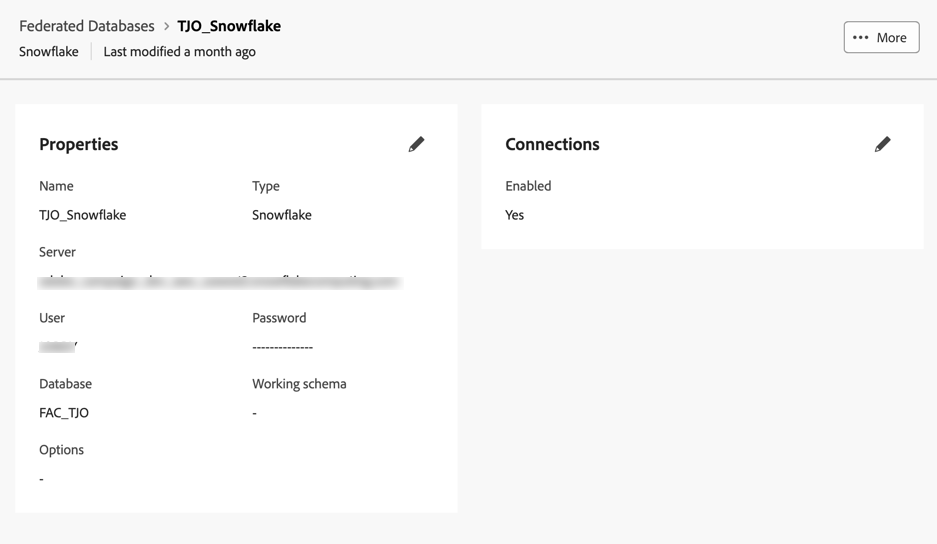

# 연결 만들기 {#connections-fdb}

Experience Platform 페더레이션된 대상자 구성을 통해 고객은 서드파티 데이터 웨어하우스에서 대상자를 빌드하고 강화한 후 대상자를 Adobe Experience Platform으로 가져올 수 있습니다.

페더레이션 데이터베이스 및 Adobe Experience Platform을 사용하여 작업하려면 먼저 연결을 설정해야 합니다. 이 연결은 이 페이지에 설명된 대로 Adobe Experience Platform 사용자 인터페이스에서 사용할 수 있는 전용 사용자 인터페이스에서 설정됩니다.

데이터베이스와의 연결을 설정하려면 다음 단계를 수행합니다.

1. 왼쪽 레일에서 **[!UICONTROL 페더레이션 데이터]** 섹션으로 이동합니다.

1. **[!UICONTROL 페더레이션 데이터베이스]** 링크에서 **[!UICONTROL 페더레이션 데이터베이스 추가]** 단추를 클릭합니다.

   {zoomable="yes"}

1. 데이터베이스 이름과 형식을 사용하여 연결 **[!UICONTROL 속성]**&#x200B;을 설정합니다.

   {zoomable="yes"}

   유형을 선택하면 채울 다른 속성에 액세스할 수 있습니다. [이 페이지](federated-db.md)에서 지원되는 데이터베이스에 대해 자세히 알아보세요.

   {zoomable="yes"}

   구성 설정은 데이터베이스 유형에 따라 다릅니다. 연결을 설정하는 데 필요한 세부 정보에 액세스하려면 아래 링크를 찾아보십시오.

   * [Amazon Redshift](federated-db.md#amazon-redshift)
   * [Azure Synapse](federated-db.md#azure-synapse-redshift)
   * [Google Big Query](federated-db.md#google-big-query)
   * [Snowflake](federated-db.md#snowflake)
   * [Vertica Analytics](federated-db.md#vertica-analytics)
   * [데이터 블록](federated-db.md#databricks)

1. 세부 정보를 입력한 후 **[!UICONTROL 연결 테스트]** 단추와 **[!UICONTROL 함수 배포]** 단추를 클릭합니다.

   {zoomable="yes"}

1. **[!UICONTROL 저장]** 단추를 클릭하여 연결 만들기를 완료합니다.

   아래와 같이 Federated 데이터베이스 연결에 대한 개요를 사용할 수 있습니다.

   {zoomable="yes"}
