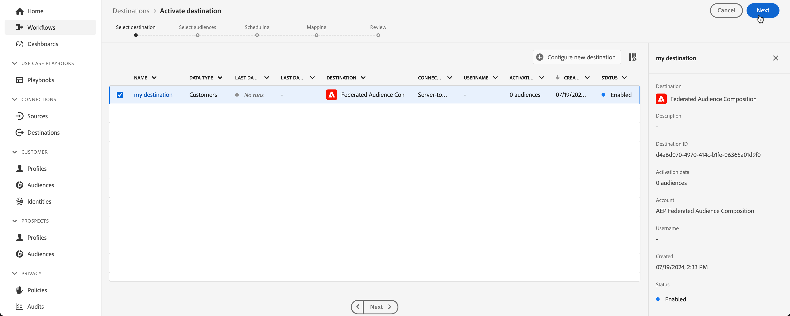
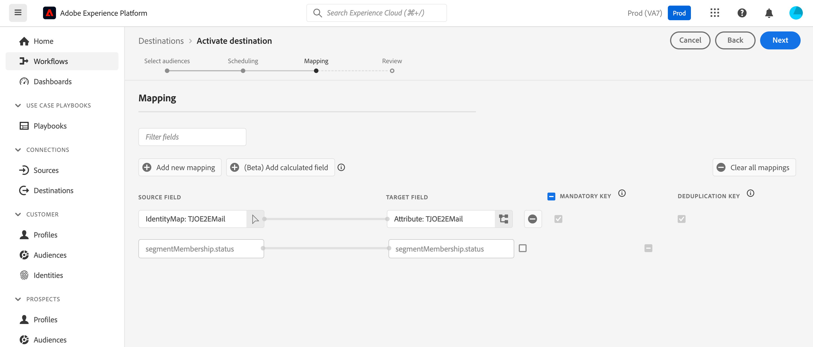

# 외부 데이터로 Adobe Experience Platform 대상 강화 {#connect-aep-fac}

>[!CONTEXTUALHELP]
>id="dc_new_destination"
>title="대상 만들기"
>abstract="새 페더레이션된 데이터베이스에 연결하기 위한 설정을 입력합니다. **[!UICONTROL 대상에 연결]** 버튼을 사용하여 구성을 확인합니다."

Adobe Experience Platform을 사용하면 **Adobe 페더레이션 대상 구성** 대상을 사용하여 대상 포털의 대상을 외부 데이터베이스에 원활하게 통합할 수 있습니다. 이렇게 하면 기존 대상을 구성에 활용하고 외부 데이터베이스의 데이터를 사용하여 보강 또는 세분화하여 새 대상을 만들 수 있습니다.

이렇게 하려면 Adobe Experience Platform에서 Adobe Federated Audience Composition 대상에 대한 새 연결을 설정해야 합니다. 스케줄러를 사용하여 특정 대상을 정기적으로 보내고, 포함할 특정 속성(예: 데이터 조정을 위한 ID)을 선택할 수 있습니다. 거버넌스 및 개인정보 처리방침을 대상에 적용한 경우 대상이 업데이트되면 유지되어 대상 포털로 다시 전송됩니다.

예를 들어, 데이터 웨어하우스에 고객 신용 점수를 저장하고 지난 2개월 내에 특정 제품에 관심이 있는 고객을 타깃팅하는 Adobe Experience Platform 대상이 있는 경우 페더레이션 대상 구성 대상을 사용하여 신용 점수를 기반으로 이 대상을 세분화할 수 있습니다. 이 프로세스를 사용하면 데이터 웨어하우스에서 민감한 신용 점수 데이터를 전송하지 않고 신용 점수가 높은 프로필만 포함하도록 대상자를 필터링할 수 있습니다.

Adobe Experience Platform 대상자를 Adobe Federated Audience Composition으로 전송하는 주요 단계는 다음과 같습니다.

1. Adobe Experience Platform 대상 카탈로그에 액세스하고 Federated Audience Composition 대상을 선택합니다.

   오른쪽 창에서 **[!UICONTROL 새 대상 구성]**&#x200B;을 선택합니다.

   

1. 새 연결의 이름을 입력하고 사용할 **[!UICONTROL 연결 유형]**&#x200B;과 연결할 **[!UICONTROL 페더레이션 데이터베이스]**&#x200B;를 선택하고 **[!UICONTROL 다음]**&#x200B;을 클릭합니다.

   

   **[!UICONTROL 경고]** 섹션에서 대상으로의 데이터 흐름 상태에 대한 알림을 받을 수 있도록 알림을 설정할 수 있습니다. 경고에 대한 자세한 내용은 [UI를 사용하여 대상 경고 구독](https://experienceleague.adobe.com/en/docs/experience-platform/destinations/ui/alerts)에 대한 안내서를 참조하십시오.

1. **[!UICONTROL 거버넌스 정책 및 시행 작업]** 단계에서는 데이터 거버넌스 정책을 정의하고 대상자를 보내고 활성화할 때 사용된 데이터가 준수되는지 확인할 수 있습니다.

   대상에 대해 원하는 마케팅 액션 선택을 마치면 **[!UICONTROL 만들기]**&#x200B;를 클릭합니다.

1. 대상에 대한 새 연결이 만들어집니다. 이제 대상을 활성화하여 대상으로 전송할 수 있습니다. 이렇게 하려면 목록에서 선택한 후 **[!UICONTROL 다음]**&#x200B;을 클릭합니다

   

1. 보내려는 대상을 선택하고 **[!UICONTROL 다음]**&#x200B;을(를) 클릭합니다.

1. 선택한 대상에 대한 파일 이름 및 내보내기 일정을 구성합니다.

   

   >[!NOTE]
   >
   >일정 및 파일 이름을 구성하는 방법에 대한 자세한 내용은 Adobe Experience Platform 설명서를 참조하십시오.
   >* [대상자 내보내기 예약](https://experienceleague.adobe.com/en/docs/experience-platform/destinations/ui/activate/activate-batch-profile-destinations#scheduling)
   >* [파일 이름 구성](https://experienceleague.adobe.com/en/docs/experience-platform/destinations/ui/activate/activate-batch-profile-destinations#configure-file-names)

1. **[!UICONTROL 매핑]** 단계에서 대상자를 위해 내보낼 특성 및 ID 필드를 선택합니다. 자세한 내용은 Adobe Experience Platform 설명서에서 [매핑 단계](https://experienceleague.adobe.com/en/docs/experience-platform/destinations/ui/activate/activate-batch-profile-destinations#mapping)를 참조하십시오.

   

1. 대상 구성 및 대상 설정을 검토한 다음 **[!UICONTROL 마침]**&#x200B;을 클릭합니다.

   

이제 선택한 대상이 새 연결에 대해 활성화됩니다. **[!UICONTROL 대상자 활성화]** 페이지로 다시 이동하여 이 연결로 보낼 대상을 더 추가할 수 있습니다. 대상자가 활성화되면 제거할 수 없습니다.
