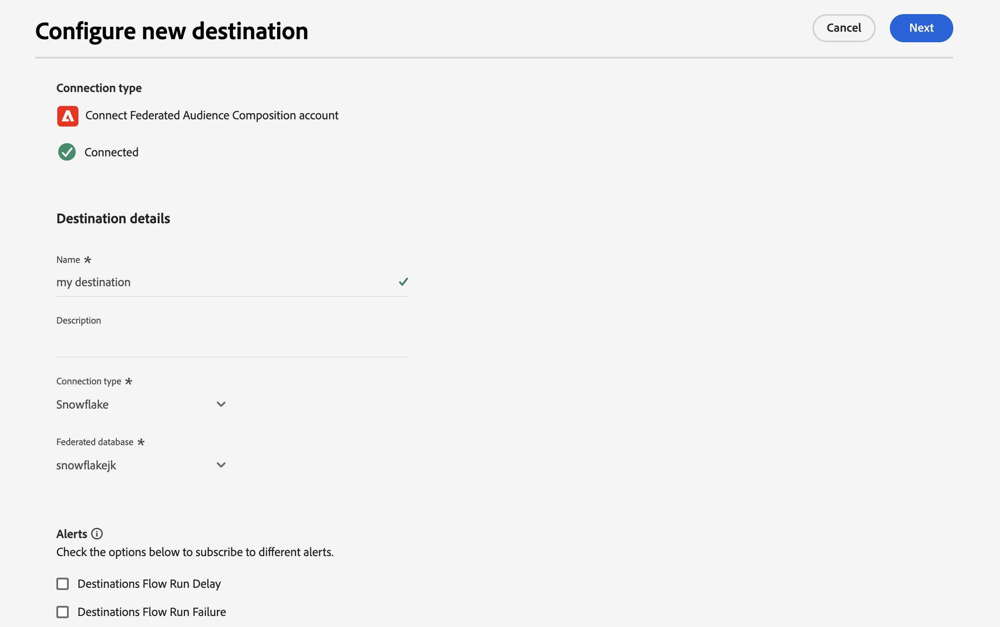
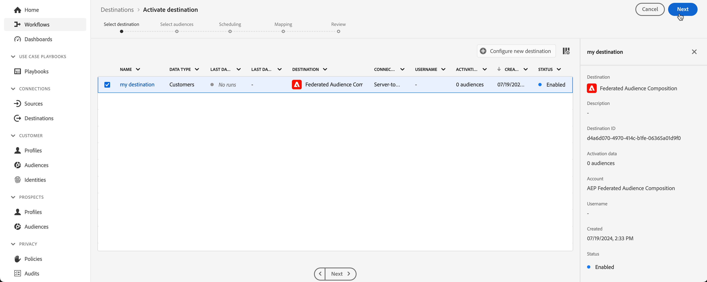
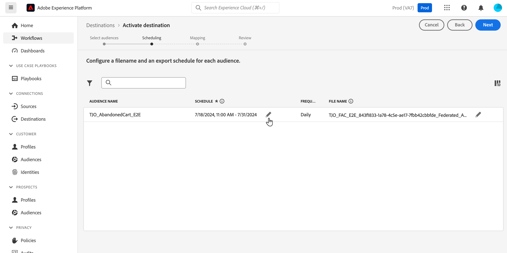
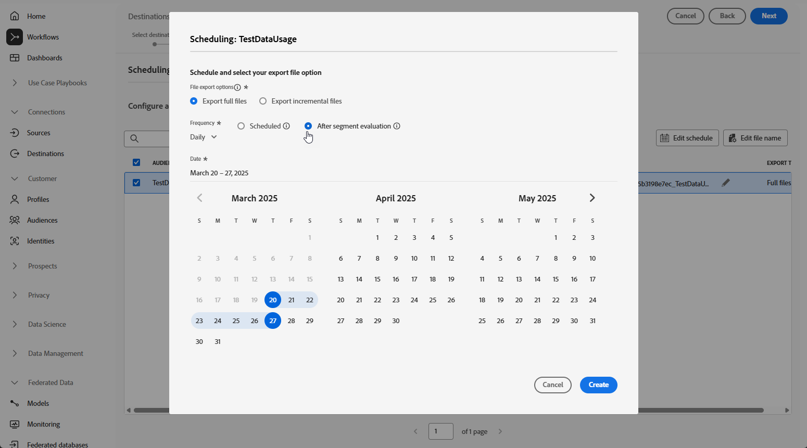
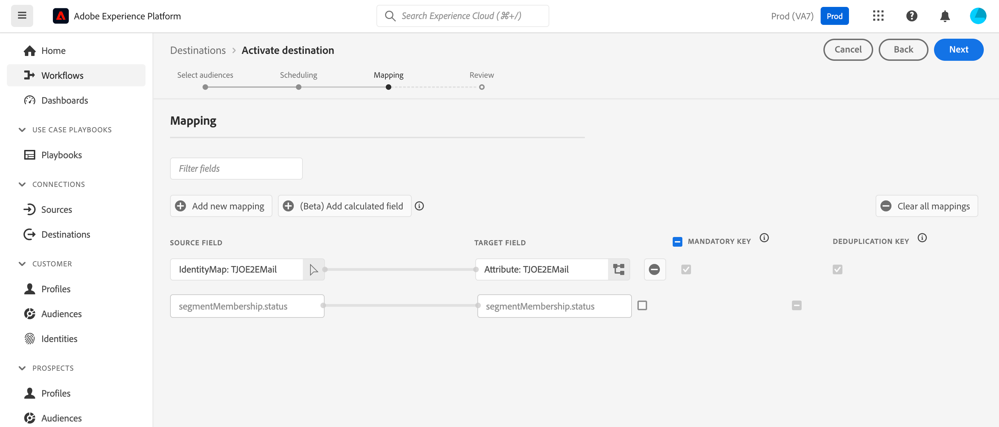
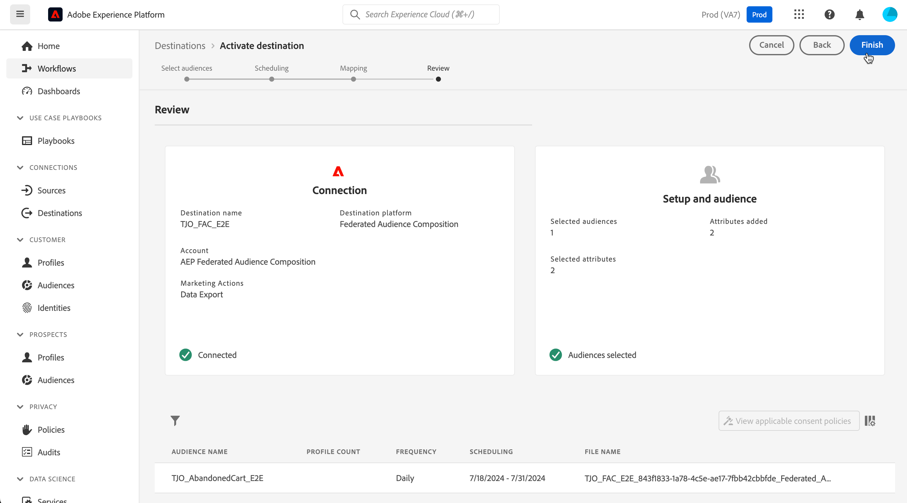

# 외부 데이터로 Adobe Experience Platform 대상자 강화 {#connect-aep-fac}

>[!CONTEXTUALHELP]
>id="dc_new_destination"
>title="대상 만들기"
>abstract="새 페더레이션된 데이터베이스에 연결하기 위한 설정을 입력합니다. **[!UICONTROL 대상에 연결]** 버튼을 사용하여 구성을 확인합니다."

Adobe Experience Platform을 사용하면 **Adobe Federated Audience Composition 대상**&#x200B;을 사용하여 Audience Portal의 대상을 외부 데이터베이스와 원활하게 통합할 수 있습니다. 이 통합을 통해 기존 대상을 구성에 활용하고 외부 데이터베이스의 데이터를 사용하여 보강 또는 세분화하여 새 대상을 만들 수 있습니다.

이렇게 하려면 Adobe Experience Platform에서 Adobe Federated Audience Composition 대상에 대한 새 연결을 설정해야 합니다. 스케줄러를 사용하여 특정 대상을 정기적으로 보내고, 포함할 특정 속성(예: 데이터 조정을 위한 ID)을 선택할 수 있습니다. 거버넌스 및 개인정보 처리방침을 대상자에 적용한 경우 대상자가 업데이트되면 해당 대상자는 유지되고 대상자 포털로 다시 전송됩니다.

예를 들어 데이터 웨어하우스에 구매 정보를 저장하고 최근 2개월 이내에 특정 제품에 관심이 있는 고객을 타깃팅하는 Adobe Experience Platform 대상을 보유하고 있다고 가정해 보겠습니다. Federated Audience Composition 대상을 사용하여 다음을 수행할 수 있습니다.

* 구매 정보를 기반으로 대상자를 세분화합니다. 예를 들어 $150 이상을 구매한 고객을 타겟팅하도록 대상을 필터링할 수 있습니다.
* 제품 이름 및 구매 수량 등 구매와 관련된 필드로 대상자를 보강합니다.

## 대상에 대상 활성화 {#activate}

Adobe Experience Platform 대상 카탈로그 내에서 Federated Audience Composition 대상을 선택합니다. 오른쪽 창에서 **[!UICONTROL 새 대상 구성]**&#x200B;을 선택합니다.

**[!UICONTROL 새 대상 구성]** 페이지가 나타납니다. 이 페이지에서는 이름, 설명, 연결 유형 및 통합 데이터베이스를 포함하여 대상의 세부 정보를 구성할 수 있습니다.

**[!UICONTROL 경고]** 섹션에서 경고를 활성화하여 대상에 대한 데이터 흐름 상태에 대한 알림을 받을 수 있습니다. 여기에는 데이터 흐름 실행 지연, 실행 실패, 실행 성공, 실행 시작 및 활성화 건너뛰기에 대한 경고가 포함됩니다.

경고에 대한 자세한 내용은 [UI를 사용하여 대상 경고를 구독](https://experienceleague.adobe.com/en/docs/experience-platform/destinations/ui/alerts){target="_blank"}하는 방법에 대한 Adobe Experience Platform 설명서를 참조하십시오.

대상의 세부 정보 구성을 마치면 **[!UICONTROL 다음]**&#x200B;을(를) 선택하십시오. **[!UICONTROL 거버넌스 정책 및 시행 작업]** 단계가 나타납니다. 이 페이지에서는 데이터 거버넌스 정책을 정의하고 대상자가 전송되고 활성화될 때 사용된 데이터가 규정을 준수하는지 확인할 수 있습니다.

대상에 대해 원하는 마케팅 액션 선택을 마치면 **[!UICONTROL 만들기]**&#x200B;를 선택합니다.

대상에 대한 새 연결이 만들어집니다. 이제 대상을 활성화하여 대상으로 전송할 수 있습니다. 대상자를 활성화할 대상을 선택한 후 **[!UICONTROL 다음]**&#x200B;을(를) 선택하십시오.

**[!UICONTROL 예약]** 단계가 표시됩니다. 대상에 활성화하려는 대상을 선택할 수 있습니다. 일정을 설정하려면 을 선택하여 내보내기 일정을 편집하세요.

**[!UICONTROL 예약]** 팝오버가 나타납니다. 이 팝오버에서 파일 내보내기 옵션, 빈도 및 일정을 정의할 수 있습니다.

>[!NOTE]
>
>대상자를 더 빨리 활성화하려면 **[!UICONTROL 세그먼트 평가 후]** 옵션을 선택하여 일별 플랫폼 일괄 처리 세분화 작업이 완료된 후 즉시 활성화 작업을 트리거합니다.
>
>예약 및 파일 이름을 구성하는 방법에 대한 자세한 내용은 Adobe Experience Platform 설명서의 다음 섹션을 참조하십시오.
>
>* [대상자 내보내기 예약](https://experienceleague.adobe.com/en/docs/experience-platform/destinations/ui/activate/activate-batch-profile-destinations#scheduling){target="_blank"}
>* [파일 이름 구성](https://experienceleague.adobe.com/en/docs/experience-platform/destinations/ui/activate/activate-batch-profile-destinations#configure-file-names){target="_blank"}

**[!UICONTROL 매핑]** 단계에서 대상자를 위해 내보낼 특성 및 ID 필드를 선택합니다.

>[!IMPORTANT]
>
>대상에 대해 활성화할 때 시스템에서 생성한 열을 사용할 수 **없습니다**. 시스템 생성 열을 선택하면 오류가 발생합니다.

자세한 내용은 Adobe Experience Platform 설명서의 [매핑 섹션](https://experienceleague.adobe.com/en/docs/experience-platform/destinations/ui/activate/activate-batch-profile-destinations#mapping){target="_blank"}을 참조하십시오.

대상 구성 및 대상 설정을 검토한 다음 **[!UICONTROL 마침]**&#x200B;을 선택합니다.

이제 선택한 대상이 새 연결에 대해 활성화됩니다. **[!UICONTROL 대상자 활성화]** 페이지로 다시 이동하여 이 연결로 보낼 대상을 더 추가할 수 있습니다. 대상자가 활성화되면 제거할 수 없습니다.
