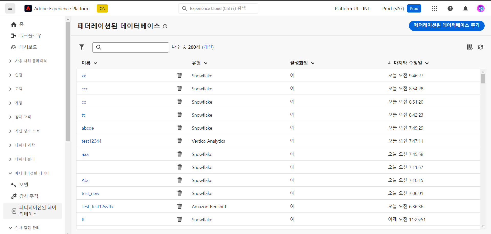
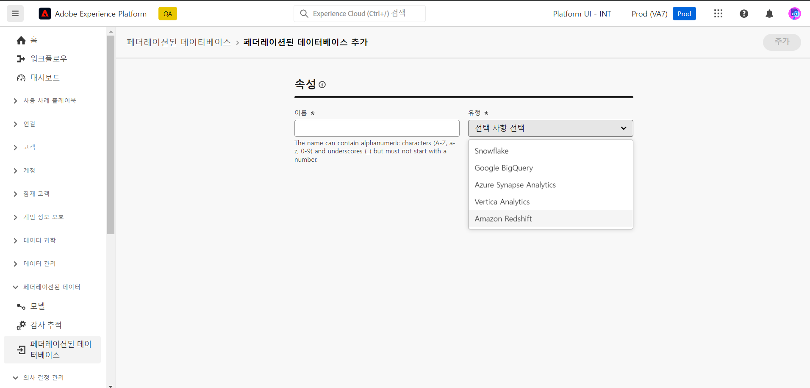
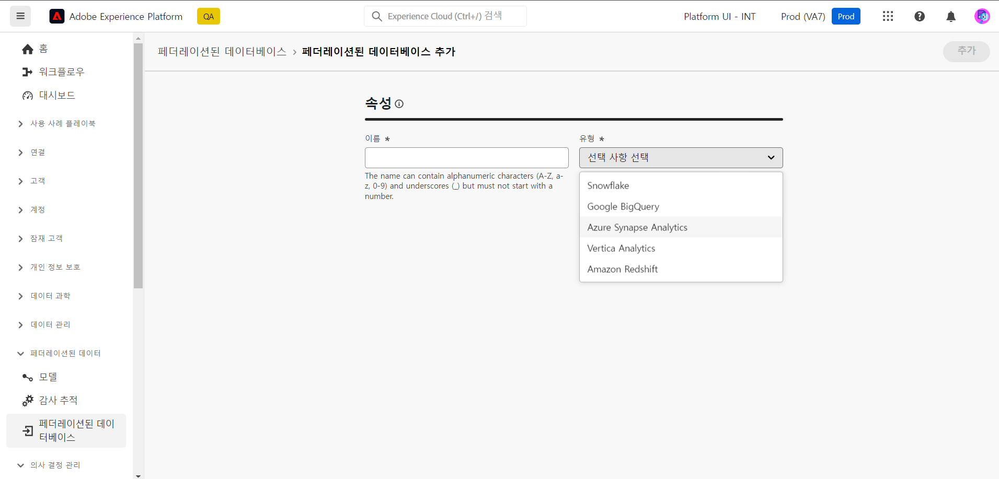
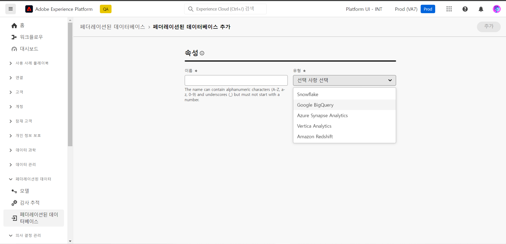
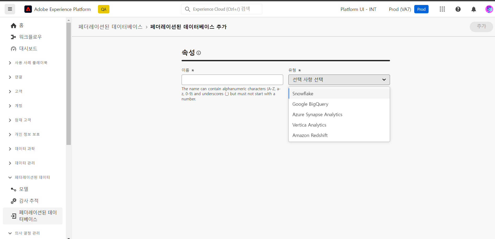
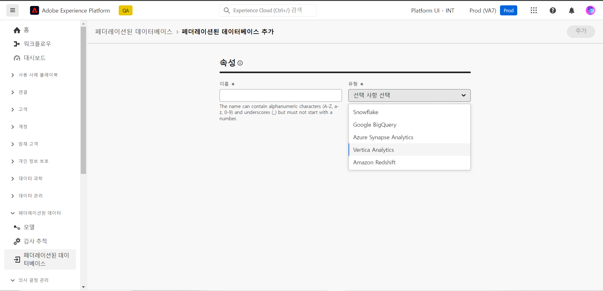

# 페더레이션된 데이터베이스 구성 {#federated-db}

>[!CONTEXTUALHELP]
>id="dc_connection_federated_database_menu"
>title="페더레이션된 데이터베이스"
>abstract="페더레이션된 데이터베이스에 대해 이전에 처리된 연결이 이 화면에 나열됩니다. 새 연결을 생성하려면 **[!UICONTROL 페더레이션된 데이터베이스 추가]** 버튼을 클릭하십시오."

>[!CONTEXTUALHELP]
>id="dc_connection_federated_database_properties"
>title="페더레이션된 데이터베이스 속성"
>abstract="새 페더레이션된 데이터베이스의 이름을 입력하고 해당 유형을 선택합니다."

>[!CONTEXTUALHELP]
>id="dc_connection_federated_database_details"
>title="페더레이션된 데이터베이스 세부 정보"
>abstract="새 페더레이션된 데이터베이스에 연결하기 위한 설정을 입력합니다. **[!UICONTROL 연결 테스트]** 버튼을 사용하여 구성을 검사합니다."

Experience Platform 페더레이션된 대상자 구성을 통해 고객은 서드파티 데이터 웨어하우스에서 대상자를 빌드하고 강화한 후 대상자를 Adobe Experience Platform으로 가져올 수 있습니다.

[이 페이지](connections.md)에서 외부 데이터베이스에 대한 연결을 만들기, 구성, 테스트 및 저장하는 방법에 대해 알아봅니다. 아래에서 지원되는 데이터베이스 목록과 각 데이터베이스에 대해 구성할 수 있는 세부 설정을 확인할 수 있습니다.

## 지원되는 데이터베이스 {#supported-db}

페더레이션된 대상자 구성을 사용하면 다음 데이터베이스에 연결할 수 있습니다. 각 데이터베이스의 구성은 아래와 같습니다.

* [Amazon Redshift](#amazon-redshift)
* [Azure Synapse](#azure-synapse-redshift)
* [Google Big Query](#google-big-query)
* [Snowflake](#snowflake)
* [Vertica Analytics](#vertica-analytics)

## Amazon Redshift {#amazon-redshift}

페더레이션된 데이터베이스를 사용하여 외부 데이터베이스에 저장된 정보를 처리합니다. 아래 단계에 따라 Amazon Redshift에 대한 액세스를 구성합니다.

1. **[!UICONTROL 페더레이션된 데이터]** 메뉴에서 **[!UICONTROL 페더레이션된 데이터베이스]**&#x200B;를 선택합니다.

1. **[!UICONTROL 페더레이션된 데이터베이스 추가]**&#x200B;를 클릭합니다.

   

1. 페더레이션된 데이터베이스에 **[!UICONTROL 이름]**&#x200B;을 입력합니다.

1. **[!UICONTROL 유형]** 드롭다운에서 Amazon Redshift를 선택합니다.

   

1. Amazon Redshift 인증 설정을 구성합니다.

   * **[!UICONTROL 서버]**: DNS의 이름을 추가합니다.

   * **[!UICONTROL 계정]**: 사용자 이름을 추가합니다.

   * **[!UICONTROL 비밀번호]**: 계정 비밀번호를 추가합니다.

   * **[!UICONTROL 데이터베이스]**: DSN에 지정되지 않은 경우 데이터베이스 이름. DSN에 지정된 경우 비워둘 수 있습니다.

   * **[!UICONTROL 작업 스키마]**: 작업 테이블에 사용할 데이터베이스 스키마의 이름입니다. [Amazon 설명서](https://docs.aws.amazon.com/redshift/latest/dg/r_Schemas_and_tables.html){target="_blank"}에서 자세히 알아보기

     >[!NOTE]
     >
     >이 스키마에 연결하는 데 필요한 권한이 있는 한, 임시 데이터 처리에 사용되는 스키마를 포함하여 데이터베이스의 모든 스키마를 사용할 수 있습니다.
     >
     >여러 샌드박스를 동일한 데이터베이스에 연결하는 경우 **개별 작업 스키마**&#x200B;를 사용해야 합니다.

1. **[!UICONTROL 연결 테스트]** 옵션을 선택하여 구성을 확인합니다.

1. **[!UICONTROL 함수 배포]** 버튼을 클릭하여 함수를 만듭니다.

1. 구성이 완료되면 **[!UICONTROL 추가]**&#x200B;를 클릭해 페더레이션된 데이터베이스를 만듭니다.

## Azure Synapse Redshift {#azure-synapse-redshift}

페더레이션된 데이터베이스를 사용하여 외부 데이터베이스에 저장된 정보를 처리합니다. 아래 단계에 따라 Azure Synapse Redshift에 대한 액세스를 구성합니다.

1. **[!UICONTROL 페더레이션된 데이터]** 메뉴에서 **[!UICONTROL 페더레이션된 데이터베이스]**&#x200B;를 선택합니다.

1. **[!UICONTROL 페더레이션된 데이터베이스 추가]**&#x200B;를 클릭합니다.

   

1. 페더레이션된 데이터베이스에 **[!UICONTROL 이름]**&#x200B;을 입력합니다.

1. **[!UICONTROL 유형]** 드롭다운에서 Azure Synapse Redshift를 선택합니다.

   

1. Azure Synapse Redshift 인증 설정을 구성합니다.

   * **[!UICONTROL 서버]**: Azure Synapse 서버의 URL을 입력합니다.

   * **[!UICONTROL 계정]**: 사용자 이름을 입력합니다.

   * **[!UICONTROL 비밀번호]**: 계정 비밀번호를 입력합니다.

   * **[!UICONTROL 데이터베이스]**(선택 사항): DSN에 지정되지 않은 경우 데이터베이스 이름을 입력합니다.

   * **[!UICONTROL 옵션]**: 커넥터는 아래 테이블에 설명된 옵션을 지원합니다.

1. **[!UICONTROL 연결 테스트]** 옵션을 선택하여 구성을 확인합니다.

1. **[!UICONTROL 함수 배포]** 버튼을 클릭하여 함수를 만듭니다.

1. 구성이 완료되면 **[!UICONTROL 추가]**&#x200B;를 클릭해 페더레이션된 데이터베이스를 만듭니다.

| 옵션 | 설명 |
|---|---|
| 인증 | 커넥터가 지원하는 인증 유형. 현재 지원되는 값: ActiveDirectoryMSI. 자세한 내용은 [Microsoft SQL 설명서](https://learn.microsoft.com/en-us/sql/connect/odbc/using-azure-active-directory?view=sql-server-ver15#example-connection-strings){target="_blank"}(예제 연결 문자열 n°8)를 참조하십시오. |

## Google Big Query {#google-big-query}

페더레이션된 데이터베이스를 사용하여 외부 데이터베이스에 저장된 정보를 처리합니다. 아래 단계에 따라 Google Big Query에 대한 액세스를 구성합니다.

1. **[!UICONTROL 페더레이션된 데이터]** 메뉴에서 **[!UICONTROL 페더레이션된 데이터베이스]**&#x200B;를 선택합니다.

1. **[!UICONTROL 페더레이션된 데이터베이스 추가]**&#x200B;를 클릭합니다.

   

1. 페더레이션된 데이터베이스에 **[!UICONTROL 이름]**&#x200B;을 입력합니다.

1. **[!UICONTROL 유형]** 드롭다운에서 Google Big Query를 선택합니다.

   

1. Google Big Query 인증 설정을 구성합니다.

   * **[!UICONTROL 서비스 계정]**: **[!UICONTROL 서비스 계정]**&#x200B;의 이메일을 입력합니다. 이에 대한 자세한 내용은 [Google Cloud 설명서](https://cloud.google.com/iam/docs/creating-managing-service-accounts){target="_blank"}를 참조하십시오.

   * **[!UICONTROL 프로젝트]**: **[!UICONTROL 프로젝트]**&#x200B;의 이름을 입력합니다. 이에 대한 자세한 내용은 [Google Cloud 설명서](https://cloud.google.com/resource-manager/docs/creating-managing-projects){target="_blank"}를 참조하십시오.

   * **[!UICONTROL 데이터 세트]**: **[!UICONTROL 데이터 세트]**&#x200B;의 이름을 입력합니다. 이에 대한 자세한 내용은 [Google Cloud 설명서](https://cloud.google.com/bigquery/docs/datasets-intro){target="_blank"}를 참조하십시오.

   * **[!UICONTROL 키 파일 경로]**: 키 파일을 서버에 업로드합니다. .json 파일만 허용됩니다.

   * **[!UICONTROL 옵션]**: 커넥터는 아래 테이블에 설명된 옵션을 지원합니다.

1. **[!UICONTROL 연결 테스트]** 옵션을 선택하여 구성을 확인합니다.

1. **[!UICONTROL 함수 배포]** 버튼을 클릭하여 함수를 만듭니다.

1. 구성이 완료되면 **[!UICONTROL 추가]**&#x200B;를 클릭해 페더레이션된 데이터베이스를 만듭니다.

| 옵션 | 설명 |
|---|---|
| ProxyType | ODBC 및 SDK 커넥터를 통해 BigQuery에 연결하는 데 사용되는 프록시 유형.  현재 HTTP(기본), http_no_tunnel, socks4 및 socks5가 지원됩니다. |
| ProxyHost | 프록시에 접근할 수 있는 호스트 이름 또는 IP 주소. |
| ProxyPort | 프록시가 실행 중인 포트 번호(예: 8080) |
| ProxyUid | 인증된 프록시에 사용되는 사용자 이름 |
| ProxyPwd | ProxyUid 비밀번호 |
| bqpath | 이는 대량 로드 도구(Cloud SDK)에만 적용됩니다.   PATH 변수를 사용하지 않거나 Google-cloud-sdk 디렉터리를 다른 위치로 이동해야 하는 경우 이 옵션을 사용하여 서버의 cloud sdk bin 디렉터리에 대한 정확한 경로를 지정할 수 있습니다. |
| GCloudConfigName | 이는 릴리스 7.3.4부터 적용되며 대량 로드 도구(Cloud SDK)에만 적용됩니다.  Google Cloud SDK는 구성을 사용하여 BigQuery 테이블에 데이터를 로드합니다. `accfda`라는 구성은 데이터를 로드하는 데 필요한 매개변수를 저장합니다. 단, 이 옵션을 사용하면 사용자가 구성에 대해 다른 이름을 지정할 수 있습니다. |
| GCloudDefaultConfigName | 이는 릴리스 7.3.4부터 적용되며 대량 로드 도구(Cloud SDK)에만 적용됩니다.  Google Cloud SDK 구성은 먼저 활성 태그를 새 구성으로 전송하지 않으면 삭제할 수 없습니다. 이 임시 구성은 데이터 로딩을 위한 기본 구성을 다시 만드는 데 필요합니다. 임시 구성의 기본 이름은 `default`이며 필요한 경우 변경할 수 있습니다. |
| GCloudRecreateConfig | 이는 릴리스 7.3.4부터 적용되며 대량 로드 도구(Cloud SDK)에만 적용됩니다.  `false`로 설정하면 대량 로딩 메커니즘은 Google Cloud SDK 구성을 다시 만들거나 삭제하거나 수정하지 않습니다. 대신에 컴퓨터의 기존 구성을 사용하여 데이터 로딩을 진행합니다. 이 기능은 다른 작업이 Google Cloud SDK 구성에 따라 달라질 때 유용합니다.   사용자가 적절한 구성 없이 이 엔진 옵션을 활성화하면 대량 로딩 메커니즘에서 다음과 같은 경고 메시지를 표시합니다. `No active configuration found. Please either create it manually or remove the GCloudRecreateConfig option`. 추가 오류를 방지하기 위해 기본 ODBC 배열 삽입 대량 로딩 메커니즘을 다시 사용합니다. |

## Snowflake {#snowflake}

페더레이션된 데이터베이스를 사용하여 외부 데이터베이스에 저장된 정보를 처리합니다. 아래 단계에 따라 Snowflake에 대한 액세스를 구성합니다.

1. **[!UICONTROL 페더레이션된 데이터]** 메뉴에서 **[!UICONTROL 페더레이션된 데이터베이스]**&#x200B;를 선택합니다.

1. **[!UICONTROL 페더레이션된 데이터베이스 추가]**&#x200B;를 클릭합니다.

   

1. 페더레이션된 데이터베이스에 **[!UICONTROL 이름]**&#x200B;을 입력합니다.

1. **[!UICONTROL 유형]** 드롭다운에서 Snowflake를 선택합니다.

   

1. Snowflake 인증 설정을 구성합니다.

   * **[!UICONTROL 서버]**: 서버 이름을 입력합니다.

   * **[!UICONTROL 사용자]**: 사용자 이름을 입력합니다.

   * **[!UICONTROL 암호]**: 계정 암호를 입력합니다.

   * **[!UICONTROL 데이터베이스]**(선택 사항): DSN에 지정되지 않은 경우 데이터베이스 이름을 입력합니다.

   * **[!UICONTROL 작업 스키마]**(선택 사항): 작업 테이블에 사용할 데이터베이스 스키마의 이름을 입력합니다.

     >[!NOTE]
     >
     >이 스키마에 연결하는 데 필요한 권한이 있는 한, 임시 데이터 처리에 사용되는 스키마를 포함하여 데이터베이스의 모든 스키마를 사용할 수 있습니다.
     >
     >여러 샌드박스를 동일한 데이터베이스에 연결하는 경우 **개별 작업 스키마**&#x200B;를 사용해야 합니다.

   * **[!UICONTROL 비공개 키]**: **[!UICONTROL 비공개 키]** 필드를 클릭하여 로케일 폴더에서 .pem 파일을 선택합니다.

   * **[!UICONTROL 옵션]**: 커넥터는 아래 테이블에 설명된 옵션을 지원합니다.

1. **[!UICONTROL 연결 테스트]** 옵션을 선택하여 구성을 확인합니다.

1. **[!UICONTROL 함수 배포]** 버튼을 클릭하여 함수를 만듭니다.

1. 구성이 완료되면 **[!UICONTROL 추가]**&#x200B;를 클릭해 페더레이션된 데이터베이스를 만듭니다.

커넥터는 다음 옵션을 지원합니다.

| 옵션 | 설명 |
|---|---|
| workschema | 작업 테이블에 사용할 데이터베이스 스키마 |
| warehouse | 사용할 기본 데이터 웨어하우스의 이름. 사용자의 기본값을 재정의합니다. |
| TimeZoneName | 기본적으로 비어 있으며, 이는 시스템 시간대 앱 서버가 사용됨을 의미합니다. 이 옵션은 TIMEZONE 세션 매개변수를 강제 적용하는 데 사용될 수 있습니다.  자세한 정보는 [이 페이지](https://docs.snowflake.net/manuals/sql-reference/parameters.html#timezone){target="_blank"}를 참조하십시오. |
| WeekStart | WEEK_START 세션 매개변수. 기본값은 0으로 설정됩니다.  자세한 정보는 [이 페이지](https://docs.snowflake.com/en/sql-reference/parameters.html#week-start){target="_blank"}를 참조하십시오. |
| UseCachedResult | USE_CACHED_RESULTS 세션 매개변수. 기본값은 TRUE로 설정됩니다. 이 옵션을 사용하면 Snowflake 캐시 결과를 비활성화할 수 있습니다.  자세한 정보는 [이 페이지](https://docs.snowflake.net/manuals/user-guide/querying-persisted-results.html){target="_blank"}를 참조하십시오. |
| bulkThreads | Snowflake 대량 로더에 사용할 스레드 수, 스레드가 많을수록 대량 로딩의 성능이 향상됩니다. 기본값은 1로 설정됩니다. 머신 스레드 수에 따라 수가 조정될 수 있습니다. |
| chunkSize | 대량 로더 청크의 파일 크기를 결정합니다. 기본값은 128MB로 설정됩니다. BulkThreads와 함께 사용할 경우 보다 최적의 성능에 맞춰 수정할 수 있습니다. 동시에 활성화된 스레드가 많을수록 성능이 향상됩니다.  자세한 내용은 [Snowflake 설명서](https://docs.snowflake.net/manuals/sql-reference/sql/put.html){target="_blank"}를 참조하십시오. |
| StageName | 사전 프로비저닝된 내부 단계의 이름. 새 임시 단계를 생성하는 대신 대량 로드에 사용됩니다. |

## Vertica Analytics {#vertica-analytics}

페더레이션된 데이터베이스를 사용하여 외부 데이터베이스에 저장된 정보를 처리합니다. 아래 단계에 따라 Vertica Analytics에 대한 액세스를 구성합니다.

1. **[!UICONTROL 페더레이션된 데이터]** 메뉴에서 **[!UICONTROL 페더레이션된 데이터베이스]**&#x200B;를 선택합니다.

1. **[!UICONTROL 페더레이션된 데이터베이스 추가]**&#x200B;를 클릭합니다.

   

1. 페더레이션된 데이터베이스에 **[!UICONTROL 이름]**&#x200B;을 입력합니다.

1. **[!UICONTROL 유형]** 드롭다운에서 Vertica Analytics를 선택합니다.

   

1. Vertica Analytics 인증 설정을 구성합니다.

   * **[!UICONTROL 서버]**: [!DNL Vertica Analytics] 서버의 URL을 추가합니다.

   * **[!UICONTROL 계정]**: 사용자 이름을 추가합니다.

   * **[!UICONTROL 비밀번호]**: 계정 비밀번호를 추가합니다.

   * **[!UICONTROL 데이터베이스]**(선택 사항): DSN에 지정되지 않은 경우 데이터베이스 이름을 입력합니다.

   * **[!UICONTROL 작업 스키마]**(선택 사항): 작업 테이블에 사용할 데이터베이스 스키마의 이름을 입력합니다.

     >[!NOTE]
     >
     >이 스키마에 연결하는 데 필요한 권한이 있는 한, 임시 데이터 처리에 사용되는 스키마를 포함하여 데이터베이스의 모든 스키마를 사용할 수 있습니다.
     >
     >여러 샌드박스를 동일한 데이터베이스에 연결하는 경우 **개별 작업 스키마**&#x200B;를 사용해야 합니다.

   * **[!UICONTROL 옵션]**: 커넥터는 아래 테이블에 설명된 옵션을 지원합니다.

1. **[!UICONTROL 연결 테스트]** 옵션을 선택하여 구성을 확인합니다.

1. **[!UICONTROL 함수 배포]** 버튼을 클릭하여 함수를 만듭니다.

1. 구성이 완료되면 **[!UICONTROL 추가]**&#x200B;를 클릭해 페더레이션된 데이터베이스를 만듭니다.

커넥터는 다음 옵션을 지원합니다.

| 옵션 | 설명 |
|---|---|
| TimeZoneName | 기본적으로 비어 있으며, 이는 앱 서버의 시스템 시간대가 사용됨을 의미합니다. 이 옵션은 TIMEZONE 세션 매개변수를 강제 적용하는 데 사용될 수 있습니다. |
