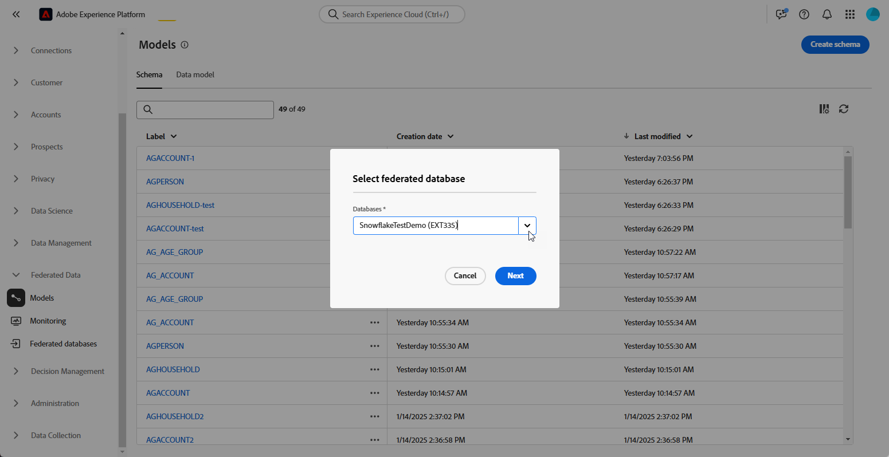
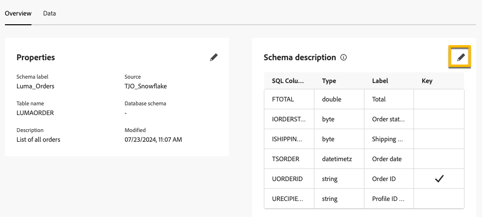

# 스키마 시작하기 {#schemas}

>[!CONTEXTUALHELP]
>id="dc_schema_create_select_tables"
>title="테이블 선택"
>abstract="데이터 모델에 추가할 테이블을 선택합니다."

>[!CONTEXTUALHELP]
>id="dc_schema_create_key"
>title="키"
>abstract="데이터 조정을 위한 키를 선택합니다."

>[!CONTEXTUALHELP]
>id="dc_schema_create_schema_name"
>title="스키마 이름"
>abstract="스키마 이름을 입력합니다."

>[!CONTEXTUALHELP]
>id="dc_schema_edit_description"
>title="스키마 설명"
>abstract="스키마 설명에는 열, 유형 및 레이블이 나열됩니다. 스키마에 대한 조정 키를 확인할 수도 있습니다. 스키마 정의를 업데이트하려면 연필 아이콘을 클릭합니다."

>[!CONTEXTUALHELP]
>id="dc_schema_filter_sources"
>title="필터링할 소스 데이터베이스를 선택합니다."
>abstract="소스를 기준으로 스키마를 필터링할 수 있습니다. 하나 이상의 페더레이션된 데이터베이스를 선택하여 해당 스키마를 표시합니다."

## 스키마란? {#schema-start}

스키마는 데이터베이스의 테이블을 나타냅니다. 데이터가 데이터베이스 테이블에 연결되는 방식을 정의하는 애플리케이션 내의 객체입니다.

스키마를 만들면 FAC에서 표 표현을 조작할 수 있습니다.

- 사용자에게 이해하기 쉬운 이름과 설명을 제공하십시오
- 실제 용도에 따라 각 필드의 가시성을 결정합니다
- 필요한 경우 [데이터 모델](../data-management/gs-models.md#data-model-start)에서 기본 키를 선택하여 스키마 간에 스키마를 연결합니다

## 스키마 만들기 {#schema-create}

FAC에서 스키마를 만들려면 아래 단계를 따르십시오.
**[!UICONTROL FEDERATED DATA]** 섹션에서 **[!UICONTROL 모델]** 링크로 이동합니다. **[!UICONTROL 스키마]** 탭이 표시됩니다.
**[!UICONTROL 스키마 만들기]** 단추를 클릭합니다.

{zoomable="yes"}

드롭다운 목록이 있는 새 인터페이스에 액세스할 수 있습니다
응용 프로그램에 연결된 모든 데이터베이스입니다. [데이터베이스 연결](../connections/connections.md#connections-fdb)에 대해 자세히 알아보세요.
목록에서 원본 데이터베이스를 선택하고 **[!UICONTROL 테이블 추가]** 탭을 클릭합니다.

{zoomable="yes"}

데이터베이스의 모든 테이블 목록에 액세스할 수 있습니다.

스키마를 생성할 테이블을 추가하면 다음과 같이 해당 필드에 액세스할 수 있습니다.

{zoomable="yes"}

각 테이블에 대해 다음 작업을 수행할 수 있습니다.

- 주어진 스키마 레이블 이름 바꾸기
- 설명 추가
- 모든 필드의 이름을 변경하고 표시 여부를 결정합니다.
- 스키마 기본 키 선택

예를 들어 다음은 추가 바로 뒤에 가져온 표입니다.

{zoomable="yes"}

스키마는 다음과 같이 정의할 수 있습니다.

{zoomable="yes"}

## 스키마 편집 {#schema-edit}

스키마를 편집하려면 스키마 폴더에서 스키마 이름을 누릅니다. 아래 페이지에 액세스할 수 있습니다.
**[!UICONTROL 편집]** 단추를 클릭합니다.

{zoomable="yes"}

스키마를 생성할 때와 동일한 가능성에 액세스할 수 있습니다.

- 주어진 스키마 레이블 이름 바꾸기
- 설명 추가
- 모든 필드의 이름을 변경하고 표시 여부를 결정합니다.
- 스키마 기본 키 선택

{zoomable="yes"}

## 스키마에서 데이터 미리 보기 {#schema-preview}

스키마가 나타내는 테이블의 데이터를 미리 보려면 아래와 같이 **[!UICONTROL 데이터]** 탭으로 이동하십시오.
**[!UICONTROL 계산]** 링크를 클릭하면 총 녹음/녹화 수를 사용할 수 있습니다.

{zoomable="yes"}

**[!UICONTROL 열 구성]** 단추를 클릭하여 데이터 개요를 변경할 수 있습니다.

{zoomable="yes"}

## 스키마 삭제 {#schema-delete}

스키마를 삭제하려면 **[!UICONTROL 자세히]** 버튼을 클릭한 다음 **[!UICONTROL 삭제]**&#x200B;를 클릭합니다.

{zoomable="yes"}
