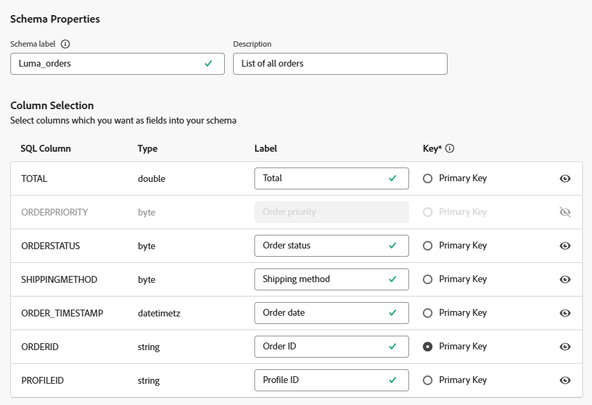
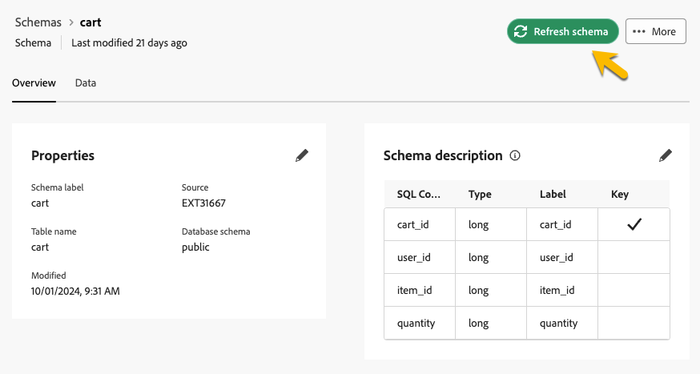

# 스키마 시작하기 {#schemas}

>[!AVAILABILITY]
>
>스키마에 액세스하려면 다음 권한 중 하나가 필요합니다.
>
>-**페더레이션 스키마 관리**
>-**연결된 스키마 보기**
>
>필요한 권한에 대한 자세한 내용은 [Access Federated Audience Composition 안내서](/help/start/feature-access.md)를 참조하십시오.

>[!CONTEXTUALHELP]
>id="dc_schema_create_select_tables"
>title="테이블 선택"
>abstract="데이터 모델에 추가할 테이블을 선택합니다."

>[!CONTEXTUALHELP]
>id="dc_schema_create_key"
>title="키"
>abstract="데이터 조정을 위한 키를 선택합니다."

>[!CONTEXTUALHELP]
>id="dc_schema_create_schema_name"
>title="스키마 이름"
>abstract="스키마 이름을 입력합니다."

>[!CONTEXTUALHELP]
>id="dc_schema_edit_description"
>title="스키마 설명"
>abstract="스키마 설명에는 열, 유형 및 레이블이 나열됩니다. 스키마에 대한 조정 키를 확인할 수도 있습니다. 스키마 정의를 업데이트하려면 연필 아이콘을 클릭합니다."

>[!CONTEXTUALHELP]
>id="dc_schema_filter_sources"
>title="필터링할 소스 데이터베이스를 선택합니다."
>abstract="소스를 기준으로 스키마를 필터링할 수 있습니다. 하나 이상의 페더레이션된 데이터베이스를 선택하여 해당 스키마를 표시합니다."

## 스키마 개요 {#schema-start}

스키마는 데이터베이스의 테이블을 나타냅니다. 데이터가 데이터베이스 테이블에 연결되는 방식을 정의하는 애플리케이션 내의 객체입니다.

스키마를 생성하여 Experience Platform Federated Audience Composition에서 표 표현을 정의할 수 있습니다.

* 사용자에게 이해하기 쉬운 이름과 설명을 제공하십시오
* 실제 용도에 따라 각 필드의 가시성을 결정합니다
* 필요한 경우 [데이터 모델](../data-management/gs-models.md#data-model-start)에서 기본 키를 선택하여 스키마 간에 스키마를 연결합니다

>[!CAUTION]
>
>동일한 데이터베이스를 사용하여 여러 샌드박스를 연결할 때 고유한 작업 스키마를 사용해야 합니다.
>

## 스키마 만들기 {#schema-create}

Federated Audience Composition에서 스키마를 생성하려면 아래 단계를 수행합니다.

1. **[!UICONTROL 페더레이션 데이터]** 섹션에서 **[!UICONTROL 모델]** 메뉴에 액세스합니다. **[!UICONTROL 스키마]** 탭으로 이동하여 **[!UICONTROL 스키마 만들기]**&#x200B;를 클릭합니다.

   {zoomable="yes"}

   이 단계에서는 환경에 연결된 데이터베이스를 찾을 수 있는 드롭다운 목록이 있는 새 화면에 액세스할 수 있습니다. [이 섹션](../connections/connections.md#connections-fdb)에서 데이터베이스 연결에 대해 자세히 알아보세요.

1. 목록에서 원본 데이터베이스를 선택하고 **[!UICONTROL 다음]**&#x200B;을 클릭합니다.

   {zoomable="yes"}

   그런 다음 데이터베이스의 모든 테이블 목록을 볼 수 있습니다.

1. 스키마를 생성할 테이블을 선택합니다.

1. 선택한 각 테이블은 선택한 열을 사용하여 스키마를 생성합니다. 필요에 따라 스키마와 해당 열을 구성합니다.

   {zoomable="yes"}

   각 테이블에 대해 다음 작업을 수행할 수 있습니다.

   * 스키마 레이블 변경
   * 설명 추가
   * 모든 필드 레이블의 이름을 바꾸고 가시성을 설정합니다.
   * 스키마 기본 키 선택

   스키마를 다음과 같이 정의할 수 있습니다.

   

1. 구성을 완료한 후 **[!UICONTROL 완료]**&#x200B;를 클릭합니다.

## 스키마 편집 {#schema-edit}

스키마를 편집하려면 다음 단계를 따르십시오.

1. 이전에 만든 스키마에 액세스합니다.

1. **[!UICONTROL 편집]** 단추를 클릭합니다.

   {zoomable="yes"}

1. **[!UICONTROL 스키마 편집]** 창에서 [스키마를 만들 때](#schema-create)와 동일한 옵션에 액세스하고 구성할 수 있습니다.

   {zoomable="yes"}

## 스키마에서 데이터 미리 보기 {#schema-preview}

스키마가 나타내는 테이블의 데이터를 미리 보려면 아래와 같이 **[!UICONTROL 데이터]** 탭으로 이동합니다.

총 녹음/녹화 수를 미리 보려면 **[!UICONTROL 계산]** 링크를 클릭하십시오.

{zoomable="yes"}

데이터 표시를 변경하려면 **[!UICONTROL 열 구성]** 단추를 클릭하십시오.

{zoomable="yes"}

## 스키마 새로 고침 {#schema-refresh}

통합 데이터베이스의 테이블은 업데이트, 추가 또는 제거할 수 있습니다. 이러한 경우 최신 변경 사항에 맞게 Adobe Experience Platform에서 스키마를 새로 고쳐야 합니다. 이렇게 하려면 업데이트할 스키마 이름 옆에 있는 세 점을 클릭하고 **스키마 새로 고침**&#x200B;을 선택하십시오.

스키마 정의를 편집할 때 업데이트할 수도 있습니다.

{zoomable="yes"}

## 스키마 삭제 {#schema-delete}

스키마를 삭제하려면 **[!UICONTROL 자세히]** 버튼을 클릭한 다음 **[!UICONTROL 삭제]**&#x200B;를 선택하십시오.

{zoomable="yes"}
