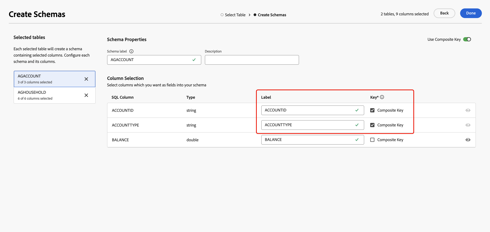

# 스키마 시작하기 {#schemas}

>[!AVAILABILITY]
>
>스키마에 액세스하려면 다음 권한 중 하나가 필요합니다.
>
>-**페더레이션 스키마 관리**
>>-**연결된 스키마 보기**
>
>필요한 권한에 대한 자세한 내용은 [액세스 제어 안내서](/help/governance-privacy-security/access-control.md)를 참조하십시오.

>[!CONTEXTUALHELP]
>id="dc_schema_create_select_tables"
>title="테이블 선택"
>abstract="데이터 모델에 추가할 테이블을 선택합니다."

>[!CONTEXTUALHELP]
>id="dc_schema_create_key"
>title="키"
>abstract="데이터 조정을 위한 키를 선택합니다."

>[!CONTEXTUALHELP]
>id="dc_schema_create_schema_name"
>title="스키마 이름"
>abstract="스키마 이름을 입력합니다."

>[!CONTEXTUALHELP]
>id="dc_schema_edit_description"
>title="스키마 설명"
>abstract="스키마 설명에는 열, 유형 및 레이블이 나열됩니다. 스키마에 대한 조정 키를 확인할 수도 있습니다. 스키마 정의를 업데이트하려면 연필 아이콘을 클릭합니다."

>[!CONTEXTUALHELP]
>id="dc_schema_filter_sources"
>title="필터링할 소스 데이터베이스를 선택합니다."
>abstract="소스를 기준으로 스키마를 필터링할 수 있습니다. 하나 이상의 페더레이션된 데이터베이스를 선택하여 해당 스키마를 표시합니다."

## 스키마 개요 {#schema-start}

스키마는 데이터베이스의 테이블을 나타냅니다. 데이터가 데이터베이스 테이블에 연결되는 방식을 정의하는 애플리케이션 내의 객체입니다.

스키마를 생성하여 Experience Platform Federated Audience Composition에서 표 표현을 정의할 수 있습니다.

* 사용자에게 이해하기 쉬운 이름과 설명을 제공하십시오
* 실제 용도에 따라 각 필드의 가시성을 결정합니다
* 필요한 경우 [데이터 모델](../data-management/gs-models.md#data-model-start)에서 기본 키를 선택하여 스키마 간에 스키마를 연결합니다

>[!CAUTION]
>
>동일한 데이터베이스를 사용하여 여러 샌드박스를 연결할 때 고유한 작업 스키마를 사용해야 합니다.

## 스키마 만들기 {#schema-create}

Federated Audience Composition에서 스키마를 만들려면 **[!UICONTROL Federated Data]** 섹션에서 **[!UICONTROL 모델]**&#x200B;을(를) 선택하십시오. **[!UICONTROL 스키마]** 탭에서 **[!UICONTROL 스키마 만들기]**&#x200B;를 선택합니다.

{zoomable="yes"}

**[!UICONTROL 페더레이션된 데이터베이스 선택]** 팝오버가 나타납니다. 이 팝오버에서는 [소스 데이터베이스](/help/connections/home.md)를 선택한 후 **[!UICONTROL 다음]**&#x200B;을 선택할 수 있습니다.

{zoomable="yes"}

**테이블 선택** 팝오버가 나타납니다. 이 팝오버에서는 스키마를 만드는 데 사용할 테이블을 선택할 수 있습니다.

{zoomable="yes"}

선택한 각 테이블은 선택한 열을 사용하여 스키마를 생성합니다. 각 테이블에 대해 스키마 레이블을 변경하고, 설명을 추가하고, 필드 레이블 이름을 변경하고, 필드 레이블 가시성을 설정하고, 스키마 기본 키를 선택할 수 있습니다.

{zoomable="yes"}

>[!NOTE]
>
>**[!UICONTROL 합성 키 사용]**&#x200B;을 사용하도록 설정했지만 사용할 키를 하나만 선택하면 키가 표준 스키마 기본 키로 처리됩니다.

또한 여러 스키마 열로 구성된 키를 만들 수도 있습니다. **[!UICONTROL 복합 키 사용]**&#x200B;을 켜고 사용할 키를 복합 키로 표시합니다.

구성을 완료한 후 **[!UICONTROL 완료]**&#x200B;를 선택하여 스키마 만들기를 완료합니다.

## 스키마 편집 {#schema-edit}

스키마를 편집하려면 **스키마** 페이지에서 이전에 만든 스키마를 선택하십시오.

[스키마 세부 정보] 페이지가 나타납니다. 스키마를 편집하려면 을 선택하세요.

{zoomable="yes"}

**[!UICONTROL 스키마 편집]** 창에서 [스키마를 만들 때](#schema-create)와 동일한 옵션에 액세스하고 구성할 수 있습니다.

{zoomable="yes"}

## 스키마에서 데이터 미리 보기 {#schema-preview}

스키마가 나타내는 테이블의 데이터를 미리 보려면 아래와 같이 **[!UICONTROL 데이터]** 탭으로 이동합니다.

총 녹음/녹화 수를 미리 보려면 **[!UICONTROL 계산]** 링크를 선택하십시오.

{zoomable="yes"}

데이터 표시를 변경하려면 **[!UICONTROL 열 구성]** 단추를 선택하십시오.

{zoomable="yes"}

## 스키마 새로 고침 {#schema-refresh}

통합 데이터베이스의 테이블은 업데이트, 추가 또는 제거할 수 있습니다. 이러한 경우 최신 변경 사항에 맞게 Adobe Experience Platform에서 스키마를 새로 고쳐야 합니다. 이렇게 하려면 스키마 이름 옆에 있는 을 선택한 다음 **[!UICONTROL 스키마 새로 고침]**&#x200B;을 선택하십시오.

스키마 정의를 편집할 때 업데이트할 수도 있습니다.

{zoomable="yes"}

## 스키마 삭제 {#schema-delete}

스키마를 삭제하려면 을 선택한 후 **[!UICONTROL 삭제]**&#x200B;를 선택하십시오.

{zoomable="yes"}
