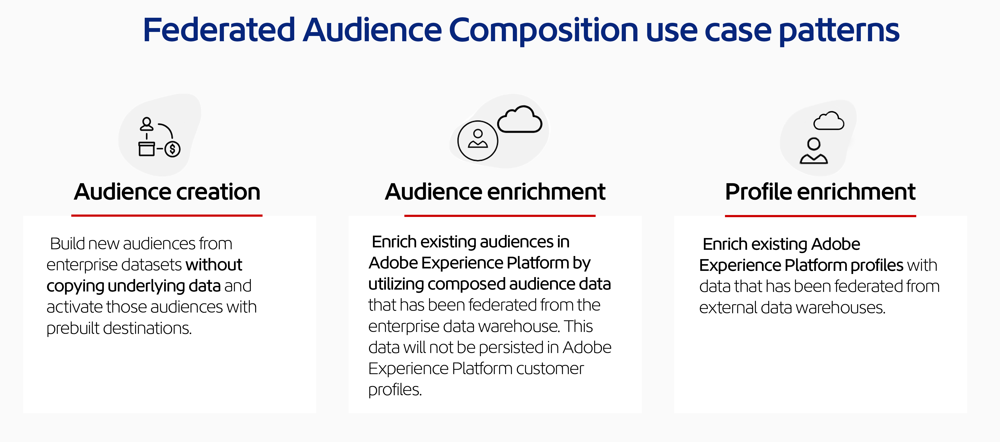

# 페더레이션된 대상자 컴포지션 개요

Federated Audience Composition lets you build and enrich audiences from your third-party data warehouses and import the audiences into Adobe Experience Platform. This brings an easy and powerful solution to connect your enterprise data warehouse directly within downstream services like Adobe Real-Time Customer Data Platform or Adobe Journey Optimizer, and perform queries on the tables of your data warehouse. As a result, you can access customer data that is stored in data warehouses and cloud storage platforms such as Amazon Redshift and Azure Synapse Analytics.

## 기능 {#rn-capabilities}

페더레이션된 대상자 컴포지션은 대상자 큐레이션 및 활성화에 대한 포괄적인 접근 방식을 통해 Real-Time CDP 및 Journey Optimizer의 가치를 확장합니다.

* **중요한 웨어하우스 기반 데이터 세트에 대한 액세스를 확장하여 고부가가치 대상 만들기**: 기존 데이터 웨어하우스를 주 기록 시스템으로 사용하는 동시에 동급 최강의 애플리케이션을 활용하여 우수한 고객 경험을 제공할 수 있습니다.

* **Comprehensive support to power engagement use cases**: Federated Audience Composition, paired with Real-Time CDP or Journey Optimizer, supports brand-initiated, personalized experiences with federated audiences and delivers in-the-moment experiences triggered by real-time events, combined with person attributes to meet use case requirements across teams.

* **Minimize data movement and duplication**: You can create audiences from datasets that live in enterprise data warehouses without copying underlying data to manage actionable marketing profiles and audiences.

* **Utilize a single system for experience-driven workflows**: You can curate both ingested and federated audiences in Adobe Experience Platform and coordinate outbound experiences across all channels.

* **Multi-edition support**: B2C and B2B CDP customers can leverage Federated Audience Composition to build people-based audiences by integrating data from supported enterprise data warehouses. Additionally, they can enrich existing Experience Platform people-based audiences by incorporating relevant attributes available in the enterprise data warehouse, enhancing their audience profiles for more personalized and targeted engagement.

## 사용 사례 {#use-cases}

페더레이션된 대상자 컴포지션은 대상자 생성, 대상자 보강, 고객 프로필 보강의 **세 가지** 사용 사례를 지원합니다.

* **Audience creation**: You can create audiences from a data warehouse and federate those audiences into Experience Platform for use in either Real-Time CDP or Journey Optimizer through a marketer friendly drag-and-drop user interface. 결과적으로, 민감한 기본 데이터를 복사하거나 기존 데이터를 복제하지 않고도 데이터 웨어하우스를 쿼리할 수 있습니다.
   * **예:** 웨어하우스의 과거 트랜잭션 데이터를 사용하여 높은 가치의 과거 구매자로 구성된 대상자를 생성하지만 해당 트랜잭션을 Experience Platform에 복사하지 않습니다.

* **Audience enrichment**: You can add more detail to your existing audiences in Experience Platform by using additional datasets from your data warehouses and overlaying your audiences with this information - all without copying the underlying data into Experience Platform. 대상자 보강을 통해 강화된 대상자에게 더 나은 개인화 경험을 제공할 수 있습니다.
   * **예:** 장바구니를 포기한 사용자로 구성된 Experience Platform 대상자를 높은 가치의 과거 구매자로 구성된 페더레이션된 대상자 컴포지션 대상자로 보강하여 타기팅된 오퍼를 제공합니다.

* **Profile enrichment**: You can select individual customer attributes from your data warehouse to enhance Experience Platform profiles. 이들 프로필에 페더레이션된 데이터를 추가하면 유입되는 고객 신호에 따라 트리거되는 즉각적인 경험을 더욱 효과적으로 제공할 수 있습니다.
   * **예:** 페더레이션된 대상자로부터의 정보로 Experience Platform 프로필을 보강합니다. 이제 높은 가치의 과거 구매자 페더레이션된 대상자에 속하는 사이트 방문자에게 사이트 내에서의 행동에 따라 트리거되는 타기팅된 오퍼를 통해 마케팅할 수 있습니다.

{zoomable="yes"}{width="75%" align="center"}

페더레이션된 대상자 컴포지션 사용 사례에 대한 자세한 내용은 [페더레이션된 대상자 컴포지션 백서](https://business.adobe.com/resources/sdk/flexibly-access-enterprise-data-with-federated-audience-composition.html)를 참조하십시오.

## 주요 단계 {#gs-steps}

Adobe 페더레이션된 대상자 컴포지션을 사용하면 수집 프로세스 없이 데이터베이스에서 Adobe Experience Platform 대상자를 직접 생성하고 업데이트할 수 있습니다.

<!--{zoomable="yes"}{width="85%" align="center"}-->

1. **Create a connection**: Bring together data from various sources, and merge them into a unified dataset. For more information on connecting Adobe Experience Platform apps to your enterprise data warehouse, supported databases, and configuring your connection, read the [connections overview](./connections/home.md).

2. **Model your data**: Design and create schemas and data models that define the structure, relationships, and constraints of the data. For more information on schemas, read the [schema overview](./data-modelling/schemas.md). For more information on data models, read the [data model overview](./data-modelling/models.md).

3. **Transform your data**: Apply data manipulation techniques to modify the format, structure, or values of data elements to make them compatible or suitable for specific analysis or applications.

4. **Compose your audience**: Create, orchestrate and build audiences. For more information on composing audiences, read the [composition overview](./compositions/home.md). Adobe Experience Platform 대상자 포털 및 대상을 통해 기존 대상자를 업데이트하거나 재사용할 수도 있습니다. [이 페이지](./connections/destinations.md)에서 자세히 알아보십시오.

>[!NOTE]
>
>컴포지션을 실행한 후에 생성된 대상자는 Adobe Experience Platform에 외부 대상자로 저장되며, Adobe Real-Time Customer Data Platform 및/또는 Adobe Journey Optimizer에서 사용할 수 있습니다. 이 기능은 **대상자** 메뉴에서 액세스할 수 있습니다. [자세히 알아보기](https://experienceleague.adobe.com/ko/docs/experience-platform/segmentation/ui/audience-portal){target="_blank"}

## 거버넌스, 개인 정보 및 보안 {#governance-privacy-security}

### 개인 정보 요청 {#gov-privacy-requests}

컴포지션을 만들면 최종 대상자가 Adobe Experience Platform에 저장됩니다.

그런 다음 Adobe Experience Platform **Privacy Service**&#x200B;를 통해 이러한 대상자에 해당하는 프로필 데이터에 액세스하거나 삭제하기 위해 개인 정보 요청을 할 수 있으며, 고객 데이터 요청을 관리하는 데 도움이 되는 [사용자 인터페이스](https://experienceleague.adobe.com/docs/experience-platform/privacy/ui/user-guide.html?lang=ko-KR){target="_blank"}와 [RESTful API](https://experienceleague.adobe.com/ko/docs/experience-platform/privacy/api/overview){target="_blank"}를 제공합니다.

>[!NOTE]
>
>Privacy Service에 대한 자세한 내용은 [Adobe Experience Platform 설명서](https://experienceleague.adobe.com/docs/experience-platform/privacy/home.html?lang=ko-KR){target="_blank"}를 참조하십시오.

Adobe 페더레이션된 대상자 컴포지션에서 고객 데이터에 액세스하고 삭제하기 위한 개별 요청을 만들고 관리할 수 있습니다. **액세스 요청**&#x200B;을 제출하고 **삭제 요청**&#x200B;을 하는 단계는 [실시간 고객 프로필 설명서](https://experienceleague.adobe.com/ko/docs/experience-platform/profile/privacy){target="_blank"}에 자세히 나와 있습니다.

### 감사 추적 {#gov-audit-trail}

The audit trail capability provides a detailed and chronological record of all actions and events that have been made to your environment in real-time. To learn more about the audit trail, please read the [audit trail overview](./admin/audit-trail.md).

## 자세히 알아보기 {#learn}

<!-- Workflow + Workflow activities-->

[이 페이지](./start/access-prerequisites.md)에서 페더레이션된 대상자 컴포지션, 가드레일 및 제한 사항에 액세스하는 방법에 대해 알아보십시오.

For answers to frequently asked questions, read the [Federated Audience Composition FAQ](./faq.md).

>[!CONTEXTUALHELP]
>id="dc_workflow_settings_execution"
>title="실행 설정"
>abstract="이 섹션에서는 컴포지션 기록이 유지되는 일 수와 같이 워크플로 실행과 관련된 설정을 구성할 수 있습니다."

>[!CONTEXTUALHELP]
>id="dc_orchestration_query_enrichment_noneditable"
>title="활동 편집 불가"
>abstract="**쿼리** 또는 **보강** 활동이 콘솔에서 추가 데이터로 구성된 경우, 보강 데이터가 고려되어 아웃바운드 전환으로 전달되지만 편집할 수는 없습니다."

<!-- Create a link -->

>[!CONTEXTUALHELP]
>id="dc_federated_database_create_link"
>title="링크 만들기"
>abstract="링크 설정을 정의합니다."

<!-- incremental query IDs -->

>[!CONTEXTUALHELP]
>id="dc_orchestration_incrementalquery"
>title="증분 쿼리"
>abstract="**증분 쿼리** 활동을 사용하면 쿼리 모델러를 사용하여 데이터베이스를 쿼리할 수 있습니다. 이 활동이 실행될 때마다 이전 실행의 결과가 제외됩니다. 이를 통해 새 요소만 타기팅할 수 있습니다."

>[!CONTEXTUALHELP]
>id="dc_orchestration_incrementalquery_history"
>title="증분 쿼리 기록"
>abstract="증분 쿼리 기록"

>[!CONTEXTUALHELP]
>id="dc_orchestration_incrementalquery_processeddata"
>title="증분 쿼리 처리된 데이터"
>abstract="증분 쿼리 처리된 데이터"

>[!CONTEXTUALHELP]
>id="dc_orchestration_incrementalmode_standard"
>title="증분 쿼리 모드"
>abstract="증분 쿼리를 사용하면 새로운 실행마다 이전 실행의 결과를 제외함으로써 동일한 쿼리를 여러 번 실행할 수 있습니다."

>[!CONTEXTUALHELP]
>id="dc_orchestration_incrementalmode_custom"
>title="증분 쿼리 모드"
>abstract="증분 쿼리를 사용하면 마지막 실행 날짜와 같거나 그 이후인 날짜 필드의 결과만 고려하여 동일한 쿼리를 여러 번 실행할 수 있습니다."

>[!CONTEXTUALHELP]
>id="dc_orchestration_build_audience_dimension"
>title="타기팅 차원 선택"
>abstract="타기팅 차원을 사용하면 수신자, 약정 수혜자, 운영자, 구독자 등 작업에서 타기팅하는 집단을 정의할 수 있습니다. 기본적으로 이메일 및 SMS의 경우 기본 제공 수신자 테이블에서 타깃이 선택됩니다. 푸시 알림의 경우 기본 타기팅 차원은 구독자 애플리케이션입니다."

