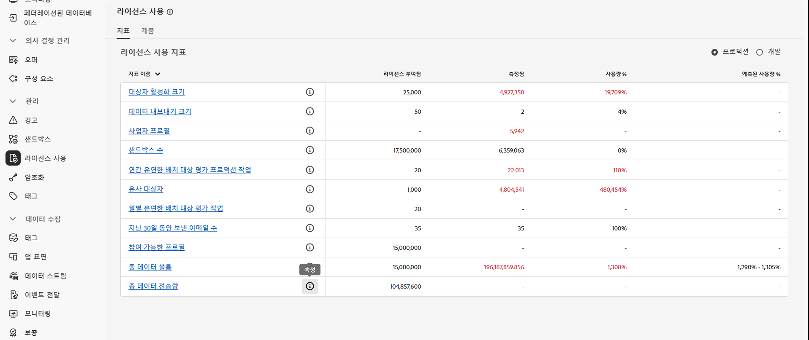
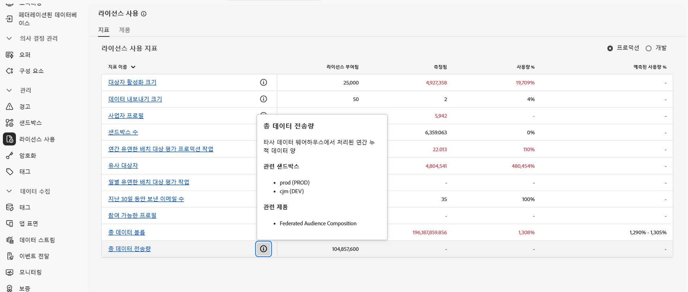

# 사전 요구 사항 및 가드레일 {#fac-access}

페더레이션된 대상자 구성을 위해서는 Adobe Real-Time Customer Data Platform 및/또는 Adobe Journey Optimizer **Prime** 또는 **Ultimate** 패키지가 필요합니다. 이 기능에 액세스하기 위해서는 페더레이션된 대상자 구성 추가 기능을 구입해야 합니다.

>[!AVAILABILITY]
>
>Adobe로부터 환영 이메일 알림을 받은 후 인터페이스가 업데이트되고 기능을 사용할 수 있게 되기까지 몇 시간이 더 걸릴 수 있습니다.

## 지원되는 시스템 {#supported-systems}

페더레이션된 대상자 구성은 다음의 클라우드 웨어하우스를 지원합니다.

* Amazon Redshift
* Azure Synapse
* Databricks
* Google Big Query
* Snowflake
* Vertica Analytics
* Microsoft Fabric

[이 페이지](../connections/connections.md)에서 이러한 시스템과의 연결을 만드는 방법을 알아보세요.

## 샌드박스

페더레이션된 대상자 구성을 구매하면 샌드박스 두 개를 사용할 수 있습니다. 추가 샌드박스 프로비저닝 요청이 있는 경우 Adobe 담당자에게 문의하십시오.

활성 페더레이션 대상 컴포지션 샌드박스 목록을 보려면 아래 단계를 따르십시오.

1. Federated Audience Composition에서 **[!UICONTROL 관리]**&#x200B;의 **[!UICONTROL 라이선스 사용]** 메뉴에 액세스합니다.

1. 샌드박스 속성에 액세스하려면 **[!UICONTROL 총 데이터 이그레스 볼륨]**&#x200B;에서  아이콘을 클릭하십시오.

   

1. 샌드박스에 대한 정보가 속성 팝오버에 표시됩니다.

   

## 권한 {#permissions}

페더레이션된 대상자 구성에 액세스하려면 구매 시 생성된 샌드박스별 제품 프로필에 사용자를 추가하고 **[!UICONTROL 페더레이션된 데이터 관리]** 권한을 할당해야 합니다. [자세히 알아보기](feature-access.md)

## IP 허용 목록에 추가 {#ip}

페더레이션된 대상자 구성이 데이터베이스에 안전하게 액세스할 수 있도록 하려면 액세스할 페더레이션된 대상자 구성 서버의 IP 주소에 대한 권한이 있어야 합니다. 이들 IP 주소는 Adobe Experience Platform 사용자 인터페이스에서 페더레이션된 데이터베이스를 추가할 때 표시됩니다. [자세히 알아보기](../connections/connections.md)

IP 주소를 허용 목록에 추가하여 페더레이션된 대상자 구성에 대한 액세스 권한을 부여하십시오.

## 가드레일 및 제한 사항 {#fac-guardrails}

* 페더레이션 대상 구성은 현재 [상태 데이터를 수집](https://experienceleague.adobe.com/ko/docs/events/customer-data-management-voices-recordings/governance/healthcare-shield){target="_blank"}하는 고객이 사용할 수 없습니다. [자세히 알아보기](https://experienceleague.adobe.com/ko/docs/journey-optimizer/using/audiences-profiles-identities/audiences/about-audiences){target="_blank"}

<!--
* Federated Audience Composition is compatible with Privacy & Security Shield and can be used in all verticals except for healthcare industries. Currently, Federated Audience Composition cannot be licensed to customers looking to ingest health data. [Learn more](https://experienceleague.adobe.com/en/docs/events/customer-data-management-voices-recordings/governance/healthcare-shield){target="_blank"}-->

* [Adobe Real-Time Customer Data Platform 설명서](https://experienceleague.adobe.com/ko/docs/experience-platform/profile/guardrails){target="_blank"}에 나열된 자격, 제품 제한 및 성능 보호는 Federated Audience Composition에 적용됩니다.

<!--* Federated Audience Composition supports the export of large audiences, with file sizes greater than 1 GB. For optimal performance, the maximum recommended file size is up to 20 GB.
-->

