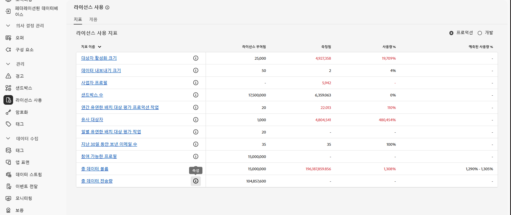
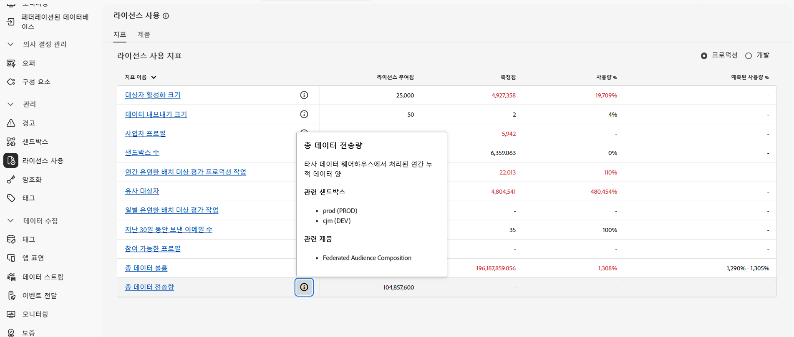

# 사전 요구 사항 및 가드레일 {#fac-access}

페더레이션된 대상자 컴포지션을 위해서는 Adobe Real-Time Customer Data Platform 및/또는 Adobe Journey Optimizer **Prime** 또는 **Ultimate** 패키지가 필요합니다. 이 기능에 액세스하기 위해서는 페더레이션된 대상자 컴포지션 추가 기능을 구입해야 합니다.

>[!AVAILABILITY]
>
>Adobe로부터 환영 이메일 알림을 받은 후 인터페이스가 업데이트되고 기능을 사용할 수 있게 되기까지 몇 시간이 더 걸릴 수 있습니다.

## 지원되는 시스템 {#supported-systems}

페더레이션된 대상자 컴포지션은 다음의 클라우드 웨어하우스를 지원합니다.

* Amazon Redshift
* Azure Synapse
* Databricks
* Google BigQuery
* Snowflake
* Vertica Analytics
* Microsoft Fabric

[연결 개요](../connections/home.md)에서 이 시스템과의 연결을 만드는 방법을 알아볼 수 있습니다.

## 샌드박스

페더레이션된 대상자 컴포지션을 구매하면 샌드박스 두 개를 사용할 수 있습니다. 추가 샌드박스 프로비저닝 요청이 있는 경우 Adobe 담당자에게 문의하십시오.

활성 페더레이션된 대상자 컴포지션 샌드박스 목록을 조회하려면 다음 단계를 따르십시오.

1. 페더레이션된 대상자 컴포지션에서 **[!UICONTROL 관리]** 아래의 **[!UICONTROL 라이선스 사용]** 메뉴에 액세스합니다.

1. **[!UICONTROL 총 데이터 전송량]**&#x200B;에서  아이콘을 선택하여 샌드박스 속성에 액세스하십시오.

   

1. 속성 팝오버에 샌드박스에 대한 정보가 표시됩니다.

   

## 권한 {#permissions}

페더레이션된 대상자 컴포지션에 액세스하려면 구매 시 생성된 샌드박스별 제품 프로필에 사용자를 추가하고 **[!UICONTROL 페더레이션된 데이터 관리]** 권한을 할당해야 합니다. [자세히 알아보기](/help/governance-privacy-security/access-control.md)

## IP 허용 목록에 추가 {#ip}

페더레이션된 대상자 컴포지션이 데이터베이스에 안전하게 액세스할 수 있도록 하려면 액세스할 페더레이션된 대상자 컴포지션 서버의 IP 주소에 대한 권한이 있어야 합니다. 이들 IP 주소는 Adobe Experience Platform 사용자 인터페이스에서 페더레이션된 데이터베이스를 추가할 때 표시됩니다. [자세히 알아보기](../connections/home.md)

IP 주소를 허용 목록에 추가하여 페더레이션된 대상자 컴포지션에 대한 액세스 권한을 부여하십시오.

## 병합 정책 {#merge-policies}

샌드박스에서 **데이터 세트 우선순위** 병합 정책을 사용하는 경우 Adobe 고객 지원 센터에 문의하여 병합 정책에 `Halos UPS` 데이터 세트를 추가하십시오.

병합 정책에 대한 자세한 내용은 [병합 정책 개요](https://experienceleague.adobe.com/ko/docs/experience-platform/profile/merge-policies/overview)를 참조하십시오.

## 가드레일 및 제한 사항 {#fac-guardrails}

* 페더레이션된 대상자 컴포지션에는 [Adobe Real-Time Customer Data Platform 설명서](https://experienceleague.adobe.com/ko/docs/experience-platform/profile/guardrails){target="_blank"}에 나열된 권한 부여, 제품 제한 및 성능 가드레일이 적용됩니다.

* 이제 페더레이션된 대상자 컴포지션이 파일 크기가 1GB를 초과하는 대규모 대상자에 대한 내보내기를 지원합니다. 최적의 성능을 위해 권장되는 파일 크기는 최대 20GB입니다.
