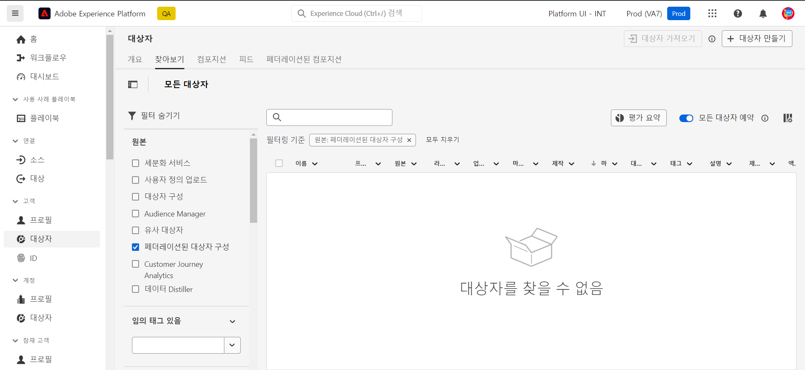

# 대상자를 사용한 작업 {#gs-audiences}

Experience Platform 페더레이션 대상 컴포지션을 사용하면 [컴포지션을 만들 수 있습니다](../compositions/gs-compositions.md). 여기서 다양한 활동을 활용하여 시각적 캔버스에 대상을 만들고 Adobe Experience Platform 대상 포털에 저장할 수 있습니다.

그런 다음 Adobe Experience Platform에서 지원하는 대상에 이러한 대상을 활성화할 수 있습니다.

## 컴포지션을 사용한 대상자 만들기 {#creation}

Federated Audience 컴포지션을 사용하여 대상을 만들려면 **[!UICONTROL 대상 저장]** 활동을 포함하는 컴포지션을 만들어야 합니다. 이 활동을 사용하면 대상을 Audience Portal에 저장하고 외부 데이터베이스에서 대상에 포함할 필드를 선택할 수 있습니다. [대상자 저장 활동을 구성하는 방법을 알아봅니다](../compositions/activities/save-audience.md)

Adobe Federated Data Composition을 사용하여 만든 대상에는 **[!UICONTROL 대상자 저장]** 활동에서 선택한 모든 필드가 포함되며, 모든 Adobe Experience Platform 대상과 함께 Audience Portal에 저장됩니다.

컴포지션을 실행한 후 결과 대상자는 Adobe Experience Platform에 외부 대상자로 저장되고 Adobe Real-Time Customer Data Platform 및/또는 Adobe Journey Optimizer에서 사용할 수 있습니다.

Adobe Experience Platform에서 지원하는 모든 대상에 이러한 대상을 활성화할 수 있습니다. [대상 작업 방법 알아보기](https://experienceleague.adobe.com/en/docs/experience-platform/destinations/home)

>[!NOTE]
>
>Adobe Federated Audience Composition을 사용하여 만든 대상은 편집할 수 없습니다. 이러한 대상 중 하나를 수정하려면 컴포지션을 사용하여 새 대상을 만들어야 합니다.

## Adobe Experience Platform에서 대상자에 액세스 {#access-audience}

Federated Audience Composition을 사용하여 만든 대상은 **Audiences** 메뉴에서 액세스할 수 있는 Audience Portal에서 액세스할 수 있습니다.

**[!UICONTROL 찾아보기]** 탭에는 Adobe Experience Platform에 저장된 모든 기존 대상자가 나열됩니다. **[!UICONTROL 원본]** 열 또는 왼쪽 창에서 사용할 수 있는 필터를 사용하여 목록에서 Federated Audience Composition 대상을 식별할 수 있습니다.

Adobe Experience Platform에서 대상자를 사용하여 작업하는 방법에 대한 자세한 내용은 [Audience Portal 설명서](https://experienceleague.adobe.com/en/docs/experience-platform/segmentation/ui/audience-portal)를 참조하십시오

<!-- add link to this donc once published: https://jira.corp.adobe.com/browse/PLAT-198674-->