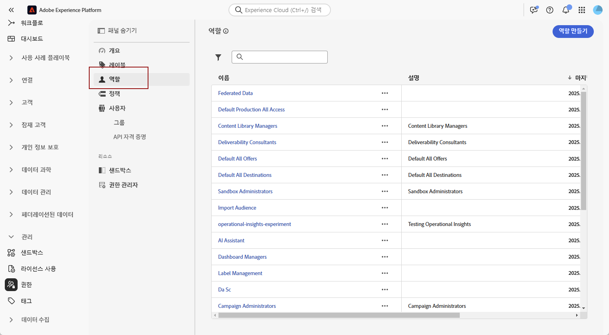
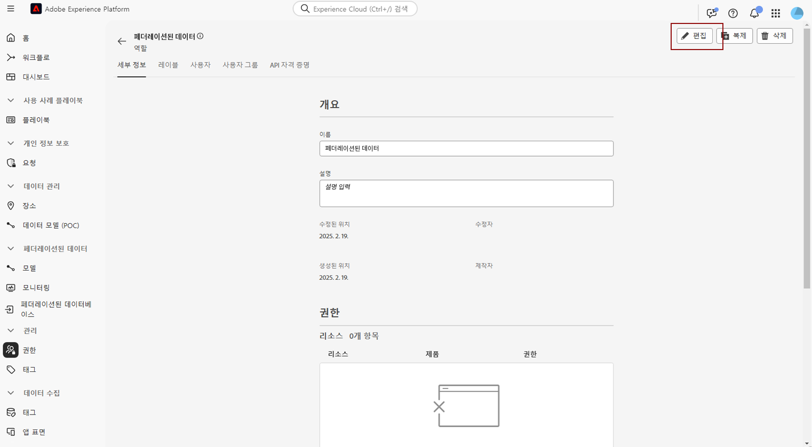
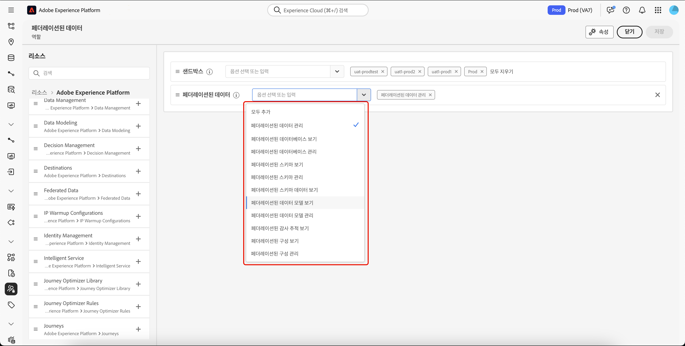
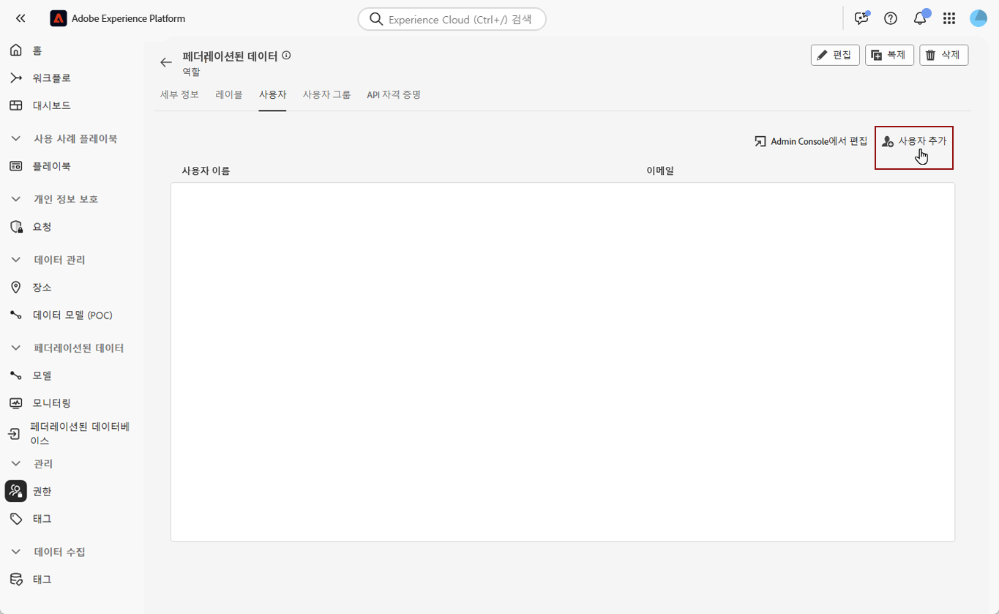

# 페더레이션된 대상자 컴포지션 액세스 {#feature-access}

## 샌드박스에 대한 액세스 관리 {#access-sandboxes}

Adobe Experience Platform 페더레이션된 대상자 컴포지션을 구매하면 해당 시점의 각 활성 샌드박스에 대한 제품 프로필이 생성됩니다. 이 제품 프로필은 Admin Console의 **Adobe Experience Platform** 제품 카드에서 생성되며 다음 명명 규칙을 따릅니다. `ACP_FAC - <<SandboxName>> - admin.` 특정 샌드박스의 페더레이션된 대상자 컴포지션에 액세스하려면 해당 샌드박스에 대해 생성된 제품 프로필에 사용자를 추가해야 합니다.

예를 들어 “fac-test”라는 새 샌드박스가 활성화되면 해당 제품 프로필 “ACP_FAC - fac-test - admin”이 생성됩니다. 이 샌드박스를 사용하여 페더레이션된 대상자 컴포지션에 액세스하려면 사용자를 이 제품 프로필에 추가해야 합니다.

## 페더레이션된 대상자 컴포지션에 대한 액세스 관리

**페더레이션된 대상자 컴포지션**&#x200B;에 액세스하려면 먼저 페더레이션된 대상자 컴포지션의 다양한 측면에 액세스하는 데 필요한 권한을 할당해야 합니다. 또한 이러한 역할은 **페더레이션된 대상자 컴포지션**&#x200B;에 액세스해야 하는 사용자에게 할당되어야 합니다.

관리자만 이러한 권한을 할당할 수 있습니다.

1. **[!UICONTROL 사용 권한]** 메뉴로 이동합니다.

1. **[!UICONTROL 역할]** 메뉴에서 업데이트하려는 **[!UICONTROL 역할]**&#x200B;을 선택합니다.

   

1. 역할의 권한을 수정하려면 **[!UICONTROL 편집]**&#x200B;을 선택합니다.

   

1. 사용자에게 필요한 권한을 추가합니다. 페더레이션된 대상자 컴포지션에 대한 액세스에 대해 다음과 같은 권한을 추가할 수 있습니다.

   | 사용 권한 | 설명 |
   | ---------- | ----------- |
   | 페더레이션된 데이터 관리 | 이 권한을 사용하여 페더레이션된 대상자 컴포지션의 모든 측면을 관리합니다. 이 권한에는 페더레이션된 데이터베이스 관리, 페더레이션된 스키마 관리, 페더레이션된 데이터 모델 관리 및 페더레이션된 컴포지션 관리가 포함됩니다. |
   | 페더레이션된 데이터베이스 관리 | 이 권한을 사용하여 페더레이션 데이터베이스에 대한 연결을 추가하고, 조회하고, 업데이트하고, 삭제할 수 있습니다. |
   | 페더레이션된 데이터베이스 보기 | 이 권한을 사용하여 페더레이션된 데이터베이스에 대한 연결을 조회할 수 있습니다. |
   | 페더레이션된 스키마 관리 | 이 권한을 사용하여 스키마를 만들고, 조회하고, 업데이트하고, 삭제하고, 새로 고침합니다. |
   | 페더레이션된 스키마 데이터 보기 | 이 권한을 사용하여 스키마 섹션 내의 데이터 탭을 볼 수 있습니다. |
   | 페더레이션된 스키마 보기 | 이 권한을 사용하여 스키마 테이블을 볼 수 있습니다. |
   | 페더레이션된 데이터 모델 관리 | 이 권한을 사용하여 데이터 모델을 만들고, 조회하고, 업데이트하고, 삭제합니다. |
   | 페더레이션된 데이터 모델 보기 | 이 권한을 사용하여 데이터 모델을 조회합니다. |
   | 페더레이션 감사 추적 보기 | 이 권한을 사용하여 페더레이션된 대상자 컴포지션에 대한 감사 추적을 조회합니다. |
   | 페더레이션된 컴포지션 관리 | 이 권한을 사용하여 페더레이션된 컴포지션을 만들고, 조회하고, 업데이트하고, 삭제합니다. |
   | 페더레이션된 컴포지션 보기 | 이 권한을 사용하여 페더레이션된 컴포지션을 조회합니다. |

   

1. 필요한 변경 내용을 적용한 후 **[!UICONTROL 저장]**&#x200B;을 선택합니다.

이미 이 역할에 할당된 사용자는 권한이 자동으로 업데이트되며, 페더레이션된 대상자 컴포지션에 액세스할 수 있게 됩니다.

새 사용자에게 이 역할을 할당하려면 다음 작업을 수행하십시오.

1. 역할 대시보드 내에서 **[!UICONTROL 사용자]** 탭으로 이동하고 **[!UICONTROL 사용자 추가]**&#x200B;를 선택합니다.

   

1. 사용자의 이름 또는 이메일 주소를 입력하거나, 사용 가능한 목록에서 선택합니다. 완료되면 **[!UICONTROL 저장]**&#x200B;을 선택합니다.

<!-- Alternatively, you can assign one of the pre-existing roles to the users, depending on what permissions they need. For more information on assigning pre-existing roles to a user, please read the [guide on managing users for a product profile](https://experienceleague.adobe.com/ko/docs/experience-platform/access-control/ui/users).

| Role name | Permissions |
| --------- | ----------- |
| FAC Data Managers | <ul><li>Manage Federated Compositions</li><li>View Federated Databases</li><li>View Federated Schemas</li><li>View Federated Schema Data</li><li>View Federated Data Models</li></ul> |
| FAC Composition Managers | <ul><li>Manage Federated Compositions</li></ul> |
| FAC Administrators | <ul><li>Manage Federated Data</li></ul> | -->

그런 다음 사용자는 인스턴스에 액세스하기 위한 지침이 포함된 이메일을 받게 됩니다. 이전에 사용자를 생성하지 않은 경우 [이 설명서](https://experienceleague.adobe.com/ko/docs/experience-platform/access-control/abac/permissions-ui/users)를 참조하십시오.
