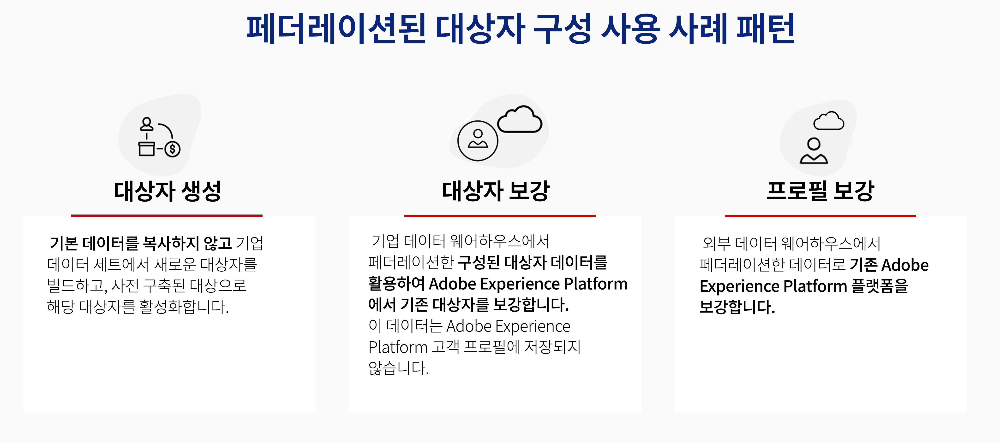
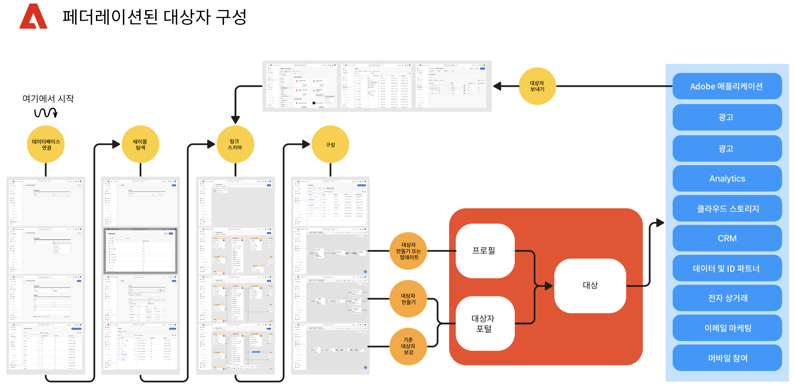

# Federated Audience 구성 시작 {#gs-fac}

Federated Audience Composition은 타사 데이터 웨어하우스에서 대상을 빌드하고 보강하여 Adobe Experience Platform으로 대상을 가져올 수 있는 [Adobe Real-time Customer Data Platform](https://experienceleague.adobe.com/en/docs/experience-platform/segmentation/home){target="_blank"} 및 [Adobe Journey Optimizer](https://experienceleague.adobe.com/ko/docs/journey-optimizer/using/ajo-home){target="_blank"}용 추가 기능입니다. Federated Audience Composition은 Adobe Real-time Customer Data Platform 및/또는 Adobe Journey Optimizer 내에서 직접 Enterprise Data Warehouse를 연결하고, Data Warehouse 테이블에서 쿼리를 수행하는 쉽고 강력한 솔루션을 제공합니다.

Adobe Federated Audience Composition을 통해 Adobe Experience Platform 앱 사용자는 데이터 웨어하우스와 Amazon Redshift, Azure synapse Analytics 등의 클라우드 스토리지 플랫폼에 저장된 고객 데이터에 액세스할 수 있습니다. 고객 데이터는 여러 데이터 웨어하우스에서 사용할 수 있으며, 이제 복제 없이 즉시 액세스할 수 있습니다. 지원되는 플랫폼은 [이 페이지](../connections/federated-db.md#supported-db)에 나열됩니다.

## 기능 {#rn-capabilities}

연합 대상 구성은 대상 큐레이션 및 활성화에 대한 포괄적인 접근 방식을 통해 Real-Time CDP 및 Journey Optimizer의 가치를 확장합니다.

* 중요한 웨어하우스 기반 데이터 세트에 대한 액세스를 확장하여 고부가가치 대상 창출: 기존 데이터 웨어하우스를 주요 기록 시스템으로 활용하는 동시에 동급 최강의 애플리케이션을 활용하여 우수한 고객 경험을 제공합니다.

* PowerEngagement 사용 사례에 대한 포괄적인 지원: Real-Time CDP 또는 Journey Optimizer과 함께 Federated Audience Composition은 Federated Audiences와 함께 브랜드에서 시작한 개인화된 경험을 지원하며, 실시간 이벤트에 의해 트리거된 즉각적인 경험을, 사용자 속성과 결합하여 팀 전체의 사용 사례 요구 사항을 충족합니다.

* 데이터 이동 및 복제 최소화: 실행 가능한 마케팅 프로필 및 대상을 관리하기 위해 기본 데이터를 복사하지 않고 엔터프라이즈 데이터 웨어하우스에 있는 데이터 세트에서 대상을 만듭니다.

* 경험 기반 워크플로우에 단일 시스템 활용: Adobe Experience Platform에서 수집된 대상 및 페더레이션 대상을 큐레이션하고 모든 채널에서 아웃바운드 경험을 조정합니다.

## 사용 사례 {#rn-uc}

마케팅 친화적인 UI를 통해 마케팅 캠페인에 필요한 특정 세그먼트에 적합한 사용자 목록을 데이터 웨어하우스에 쿼리하는 세그먼트 규칙을 만들거나, 활성화를 위해 웨어하우스의 기존 대상에 액세스하거나, 웨어하우스에 존재하는 추가 데이터 포인트로 Adobe Experience Platform 대상을 보강합니다.

이 버전에서는 두 가지 사용 사례를 사용할 수 있습니다.

1. 대상 만들기: 기본 데이터를 복사하지 않고 엔터프라이즈 데이터 세트에서 새 대상을 만들고 사전 설치된 대상을 활성화합니다&#x200B;.

1. 대상 강화: Enterprise Data Warehouse에서 페더레이션된 구성된 대상 데이터를 활용하여 Adobe Experience Platform의 기존 대상을 강화합니다. 이 데이터는 Adobe Experience Platform 고객 프로필에서 유지되지 않습니다.

{zoomable="yes"}{width="75%" align="center"}

## 주요 단계 {#gs-steps}

Adobe Federated Audience Composition을 사용하면 수집 프로세스 없이 데이터베이스에서 직접 Adobe Experience Platform 대상을 만들고 업데이트할 수 있습니다.

{zoomable="yes"}{width="85%" align="center"}

주요 단계:

1. **데이터 통합**: 다양한 소스의 데이터를 가져와서 통합 데이터 집합에 병합합니다. Adobe Experience Platform 앱과 Enterprise Data Warehouse, 지원되는 데이터베이스를 연결하는 방법과 구성 방법에 대해 알아보려면 [이 섹션](../connections/federated-db.md)을 참조하세요.

2. **데이터 모델링**: 데이터의 구조, 관계 및 제약 조건을 정의하는 데이터 모델 및 스키마를 디자인하고 만듭니다. [이 페이지](../customer/schemas.md)에서 스키마에 대해 자세히 알아보세요. [이 페이지](../data-management/gs-models.md)에서 데이터 모델에 대한 링크를 만드는 방법을 알아보세요.

3. **데이터 변환**: 데이터 조작 기술을 적용하여 데이터 요소의 형식, 구조 또는 값을 수정하여 특정 분석 또는 응용 프로그램에 호환되거나 적합하도록 만듭니다.

4. **데이터 사용**: 대상을 만들고, 조정하고, 빌드합니다. [이 페이지](../compositions/gs-compositions.md)에서 대상자를 구성하는 방법을 알아보세요. Adobe Experience Platform 대상자 포털 및 대상을 통해 기존 대상자를 업데이트하거나 재사용할 수도 있습니다. [이 페이지](../connections/destinations.md)에서 자세히 알아보기

>[!NOTE]
>
>컴포지션을 실행한 후 결과 대상자는 Adobe Experience Platform에 외부 대상자로 저장되고 Adobe Real-Time Customer Data Platform 및/또는 Adobe Journey Optimizer에서 사용할 수 있습니다. **대상자** 메뉴에서 액세스할 수 있습니다. [자세히 알아보기](https://experienceleague.adobe.com/en/docs/experience-platform/segmentation/ui/audience-portal){target="_blank"}
>

## 추가 정보 {#learn}

<!-- Workflow + Workflow activities-->

[이 페이지](faq.md)에서 FAQ를 참조하십시오.

>[!CONTEXTUALHELP]
>id="dc_workflow_settings_execution"
>title="실행 설정"
>abstract="이 섹션에서는 작성 기록이 유지되는 일 수와 같이 워크플로우 실행과 관련된 설정을 구성할 수 있습니다."

>[!CONTEXTUALHELP]
>id="dc_orchestration_query_enrichment_noneditable"
>title="활동 편집 불가"
>abstract="**쿼리** 또는 **보강** 활동이 콘솔에서 추가 데이터로 구성된 경우, 보강 데이터가 고려되어 아웃바운드 전환으로 전달되지만 편집할 수는 없습니다."

<!-- Create a link -->

>[!CONTEXTUALHELP]
>id="dc_federated_database_create_link"
>title="링크 만들기"
>abstract="링크 설정을 정의합니다."
